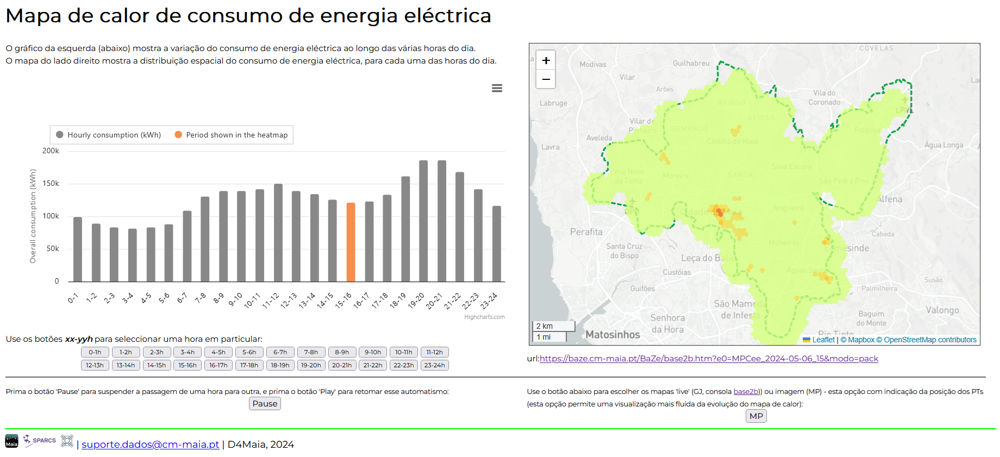

# Modelo de Decisão SmartCity-LLM: Infra-estrutura de Dados, Fundamentação e Inteligência Artificial Responsável em Cidades Inteligentes

## _Integrating Large Language Models into Municipal Decision Support Systems for Smart Cities: Data Infrastructure Foundations for Responsible AI_ 

### Reposítório de suporte ao paper submetido à 26ª Conferência da Associação Portuguesa de Sistemas de Informação

Este repositório contém toda a informação acerca das experiências que foram realizadas com LLMs e que aparecem no paper de uma forma sumariada.

Nas experiências realizadas foram usados os LLMs seguintes: 
- Claude
- ChatGPT
- Deepseek
- Perplexity
- Copilot
- Gemini

## Experiências

Lista de experiências usando todos os LLMs:
- [exp-a 1](exp-a-1/exp-1.md): Análise autónoma do endpoint de dados api4s.
- [exp-a 2](exp-a-2/exp-2.md): Análise autónoma do endpoint de dados api4gj.
- [exp-a 3](exp-a-3/exp-3.md): Análise autónoma do endpoint de dados x4rt.
- [exp 1](exp-1/exp-1.md): Utilização explicita de 2 endpoints de dados e de 2 urls relativos a uma consola de visualização de dados georeferenciados, disponível online, para construção e apresentação de um mapa com a localização dos vários sistemas de sensorização disponíveis e um gráfico onde se podem visualizar os dados dos vários sensores/sistemas.
- [exp 2](exp-2/exp-2.md): Utilização explicita de 3 endpoints de dados, para construção e apresentação de uma visualização semelhante a uma visualização disponível online na plataforma BaZe, Figura 1.

<!--  -->
*Figura 1: Visualização de referência.*

- exp 1:
- exp 2:

Lista de experiências usando apenas o Claude e usando urls e endpoints de dados da plataforma Baze:
- [exp c1](exp-c1/exp-c1.md): Utilização de um endpoint mais geral, para construção e apresentação de um dashboard do consumo de água no município.
- [exp c2](exp-c2/exp-c2.md): Utilização explícita de um endpoint de dados, para construção e apresentação de um dashboard do consumo de água no município.
- [exp c3](exp-c3/exp-c3.md): Utilização explicita de 3 endpoints de dados, para construção de uma representação (visualização) semelhante a uma já existente e disponibilizada pela plataforma Baze, Figura 2.

<!--  -->
*Figura 2: Visualização de referência.*

- exp 4:

# Autores

Informação a ser inserida mais tarde.
