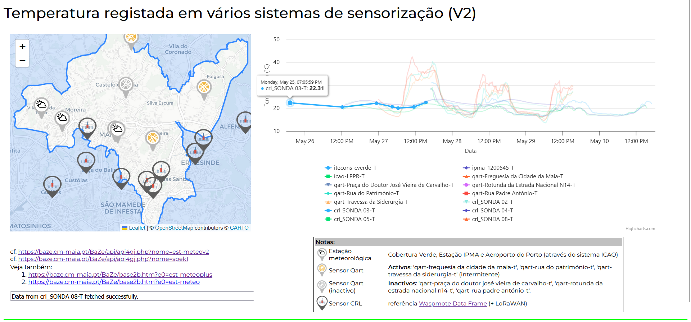

# Modelo de Decisão SmartCity-LLM: Infra-estrutura de Dados, Fundamentação e Inteligência Artificial Responsável em Cidades Inteligentes

## _Integrating Large Language Models into Municipal Decision Support Systems for Smart Cities: Data Infrastructure Foundations for Responsible AI_ 

### Reposítório de suporte ao paper submetido à 26ª Conferência da Associação Portuguesa de Sistemas de Informação

Este repositório contém toda a informação acerca das experiências que foram realizadas com LLMs e que aparecem no paper de uma forma sumariada.

Nas experiências realizadas foram usados os LLMs seguintes: 
- Claude
- ChatGPT
- Deepseek
- Perplexity
- Copilot
- Gemini

Lista de experiências com todos os LLMs:
- exp 1:
- exp 2:

Lista de experiências com o Claude usando urls e endpoints de dados da plataforma Baze:
- [exp c1](exp-c1/exp-c1.md): Utilização de um endpoint mais geral, para construção e apresentação de um dashboard do consumo de água no município.
- [exp c2](exp-c2/exp-c2.md): Utilização explícita de um endpoint de dados, para construção e apresentação de um dashboard do consumo de água no município.
- [exp c3](exp-c3/exp-c3.md): Utilização explicita de 3 endpoints de dados, para construção de uma representação (visualização) semelhante a uma já existente e disponibilizada pela plataforma Baze, Figura 1.

*Figura 1: Visualização de referência*

- exp 4:

# Autores

Informação a ser inserida mais tarde.
