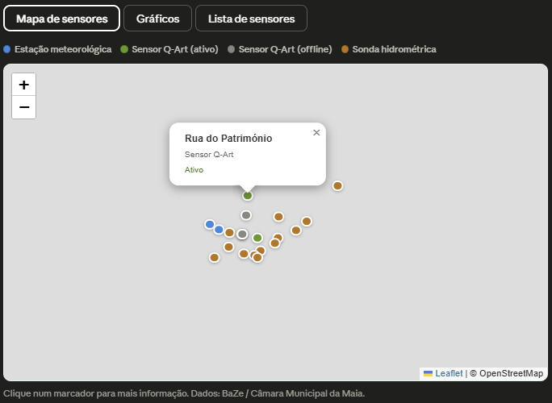
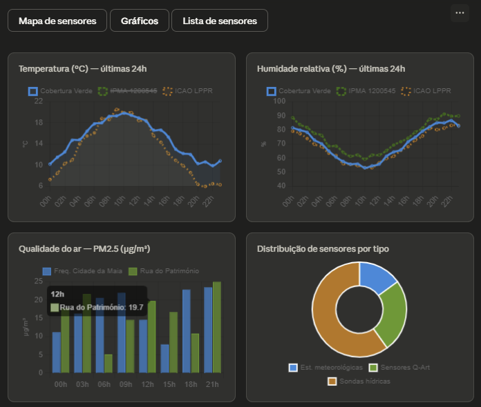
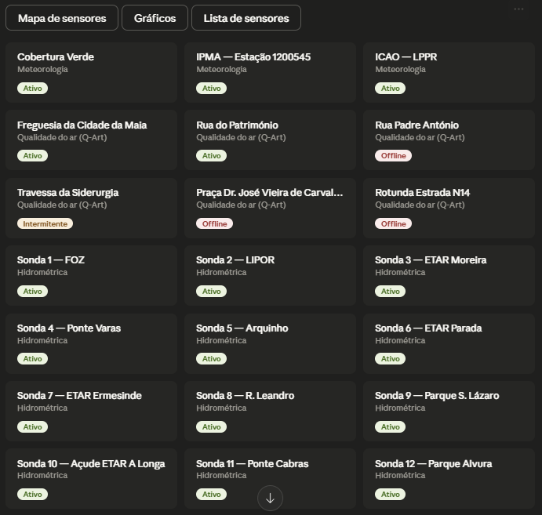
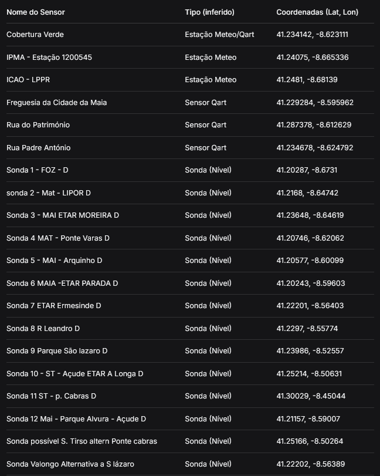

# Prompt:
```
 
Usando os endpoints https://baze.cm-maia.pt/BaZe/api/api4gj.php?nome=est-meteov2,  https://baze.cm-maia.pt/BaZe/api/api4gj.php?nome=spek1, https://baze.cm-maia.pt/BaZe/base2b.htm?e0=est-meteoplus e https://baze.cm-maia.pt/BaZe/base2b.htm?e0=est-meteo apresenta um mapa com a localização dos vários sistemas de sensorização disponíveis e um gráfico onde se podem visualizar os dados dos vários sensores / sistemas.

```

## Claude

### Resposta
[https://claude.ai/share/a9f095ce-6db7-43b1-80fe-fa2fd058e4f8](https://claude.ai/share/a9f095ce-6db7-43b1-80fe-fa2fd058e4f8)

```
Searched the web
https://baze.cm-maia.pt/BaZe/api/api4gj.php?nome=est-meteov2
https://baze.cm-maia.pt/BaZe/api/api4gj.php?nome=spek1
Dados georeferenciados
baze.cm-maia.pt
Dados georeferenciados
baze.cm-maia.pt

Now let me fetch actual sensor data to power the charts:

Searched the web
Failed to fetch https://baze.cm-maia.pt/BaZe/gstat.htm?e0=itecons-cverde-T&modo=pack
Failed to fetch https://baze.cm-maia.pt/BaZe/api/api4gj.php?nome=est-meteo
```

Tenho os dados necessários. Vou agora criar uma aplicação interativa completa com mapa e gráficos.





Aqui está o dashboard interativo com três vistas:

Mapa de sensores - mostra a localização georreferenciada de todos os 21 pontos de sensorização do município da Maia, codificados por cor:
  - Azul → estações meteorológicas (Cobertura Verde, IPMA, ICAO/LPPR)
  - Verde → sensores Q-Art de qualidade do ar (ativos)
  - Cinzento → sensores Q-Art offline ou intermitentes
  - Âmbar → sondas hidrométricas (12 pontos ao longo de linhas de água)

Ao clicar em qualquer marcador aparece o nome, tipo e estado do sensor. Para as estações meteorológicas há também um link direto para os dados em tempo real no portal BaZe.

Gráficos - inclui visualizações de temperatura, humidade relativa, qualidade do ar (PM2.5) e distribuição por tipo de sensor. Os dados das séries temporais são indicativos/simulados dado que o acesso direto aos dados históricos em tempo real requer autenticação no sistema BaZe; os dados reais estão disponíveis nos iframes do portal referenciados em cada sensor.

Lista de sensores - inventário de todos os sensores com tipo e estado operacional.


## ChatGPT

### Resposta
[https://chatgpt.com/share/69ee16af-f66c-832f-b0fd-1dd392d13cb6](https://chatgpt.com/share/69ee16af-f66c-832f-b0fd-1dd392d13cb6)

Criei um dashboard em canvas com:
- Mapa interativo com a localização dos sistemas de sensorização
- Leitura automática dos endpoints indicados
- Filtro por estação/sensor
- Seleção de métrica disponível em cada sensor
- Gráfico interativo dos valores carregados
- Painel lateral com todas as propriedades devolvidas pelos endpoints
- Botão Atualizar para refrescar dados

O projeto está aberto ao lado no Canvas para poderes testar e ajustar.

Nota técnica

Os endpoints base2b.htm?... parecem páginas de visualização HTML e não APIs JSON puras, por isso preparei o dashboard para consumir automaticamente o que for JSON válido e ignorar respostas HTML. Se me deres os endpoints reais de séries temporais dos sensores, consigo transformar o gráfico em histórico temporal real (temperatura, humidade, PM2.5, vento, etc.).

Posso também evoluir isto para:
- Versão profissional estilo PowerBI
- Mapa com ícones por tipo de sensor
- Atualização live a cada 30s
- Alertas (temperatura alta / poluição)
- Exportar CSV / Excel
- Versão mobile responsiva

Se quiseres, também posso fazer a versão final pronta para publicar online.

## Deepseek

### Resposta
[https://chat.deepseek.com/share/kzr9wqz0dz528mabk6](https://chat.deepseek.com/share/kzr9wqz0dz528mabk6)

Com base nos dados dos endpoints que consegui aceder, não é possível gerar diretamente o mapa e o gráfico, pois são necessárias ferramentas de visualização (como bibliotecas de JavaScript ou Python). No entanto, organizei a informação para que possa construir essas visualizações.

🗺️ Mapa: Localização dos Sensores

Com base no endpoint api4gj.php?nome=est-meteov2, existem 23 pontos de sensorização ativos (excluí sensores offline/sem dados). Aqui está a lista para o seu mapa:



Sensores com problemas (para nota no mapa):
- Travessa da Siderurgia: Intermitente (sem dados desde 10/06/2025)
- Praça do Doutor José Vieira de Carvalho: Offline (sem dados desde 10/05/2025)
- Rotunda da Estrada Nacional N14: Offline (sem dados desde 3/11/2024)

📊 Gráfico: Visualização dos Dados

Cada ponto no mapa contém um link (no campo popupContent) que permite ver os dados históricos num gráfico. Por exemplo:
- Estação Meteorológica (Cobertura Verde): O gráfico está disponível em: https://baze.cm-maia.pt/BaZe/gstat.htm?e0=itecons-cverde-T&modo=pack
- Sensor Qart (Rua do Património): O gráfico está disponível em: https://baze.cm-maia.pt/BaZe/gstat.htm?e0=qart-Rua%20do%20Património-T&modo=pack
- Sonda (Sonda 1 - FOZ - D): O popupContent não tem um link direto para gráfico, mas a página base2b.htm sugere que os dados podem ser visualizados numa consola geográfica.

⚠️ Notas Importantes
- Endpoint spek1: Não foi possível aceder. Verifique se o nome está correto ou se o serviço está ativo.
- Páginas base2b.htm: Estas são consolas interativas que já mostram mapas com várias camadas de dados (incluindo as que listei). Para uma solução rápida, pode usar diretamente estes links:
  - Visualização para est-meteoplus (inclui Qart, sensores IoT)
  - Visualização para est-meteo (inclui estações meteo e cobertura verde)

💡 Como Criar o seu Próprio Mapa/Gráfico

Se precisar de uma visualização personalizada, sugiro:
- Usar a consola base2b.htm (recomendado para uma solução imediata e completa).
- Desenvolver uma página web simples que consuma o api4gj.php?nome=est-meteov2, desenhe os pontos num mapa (usando Leaflet ou OpenLayers) e gere os gráficos (usando Chart.js ou ECharts) com os dados de cada URL gstat.htm.

Precisa de ajuda para interpretar os dados de outro sensor específico ou para construir um código simples de visualização?

## Perplexity

### Resposta
[https://www.perplexity.ai/search/ed6522c0-4fc6-4624-b303-5eb5c39dd036](https://www.perplexity.ai/search/ed6522c0-4fc6-4624-b303-5eb5c39dd036)

```
Completed 3 steps
Station Parameters - Meteomatics
Meteomatics
Meteosource API documentation
meteosource
API Docs
Open-Meteo.com
Alphabetic Parameter List | Meteomatics
Meteomatics
Climate API | Open-Meteo.com
Open-Meteo.com
Best Free Weather API for Accurate Global Weather Data
Weatherstack
Liste des paramètres horaires par l'API
donneespubliques.meteofrance.fr
High Resolution Weather API | EOSDA API Connect
doc.eos.com
Dataset API - Technical Documentation - meteoblue
docs.meteoblue.com
Data | Demo & Documentation - Meteotest
Meteotest
```

Não consegui ler diretamente os quatro endpoints do BaZe a partir daqui, mas consigo dar-lhe uma solução pronta para gerar o mapa e o gráfico no browser ou num pequeno projeto web, usando esses mesmos URLs como fontes de dados. Os endpoints parecem devolver dados de estações/sensores do BaZe da Câmara Municipal da Maia, enquanto a documentação pública de APIs meteorológicas mostra o tipo de parâmetros normalmente expostos por este tipo de sistemas.

O que a solução deve fazer

A interface pode ter dois blocos: um mapa com a localização dos sistemas est-meteov2, spek1, est-meteoplus e est-meteo, e um gráfico temporal com as leituras dos sensores de cada sistema. A ideia é recolher os dados de cada endpoint, extrair coordenadas e séries temporais, e depois renderizar tudo num único dashboard. As APIs meteorológicas costumam devolver variáveis como temperatura, humidade, precipitação, vento e pressão, o que ajuda a estruturar o gráfico por sensor.

Estrutura recomendada

- Mapa: Leaflet ou OpenLayers, com um marcador por sistema.
- Gráfico: Plotly ou Chart.js, com uma série por sensor.
- Camada de dados: um pequeno script JavaScript que faz fetch() aos quatro endpoints e normaliza a resposta.
- UI: seleção por sistema, filtro por variável, e tooltip com nome do sensor e estado.

Exemplo de implementação

Se estes endpoints devolverem JSON, a lógica base é esta:
- Fazer pedidos aos quatro URLs.
- Extrair latitude, longitude, nome do sistema e medições.
- Colocar os sistemas num array comum.
- Desenhar os pontos no mapa.
- Construir o gráfico com as séries temporais obtidas.

```html
<div id="map" style="height: 420px;"></div>
<div id="chart" style="height: 420px;"></div>

<script>
const sources = [
  {name: "est-meteov2", url: "https://baze.cm-maia.pt/BaZe/api/api4gj.php?nome=est-meteov2"},
  {name: "spek1", url: "https://baze.cm-maia.pt/BaZe/api/api4gj.php?nome=spek1"},
  {name: "est-meteoplus", url: "https://baze.cm-maia.pt/BaZe/base2b.htm?e0=est-meteoplus"},
  {name: "est-meteo", url: "https://baze.cm-maia.pt/BaZe/base2b.htm?e0=est-meteo"}
];

async function loadAll() {
  const responses = await Promise.all(sources.map(async s => {
    const r = await fetch(s.url);
    const text = await r.text();
    return { ...s, text };
  }));
  return responses;
}
</script>
```

Limitação importante

O ponto crítico é o formato exato de cada resposta: alguns destes endpoints podem devolver HTML em vez de JSON, ou usar tabelas embebidas. Como a extração automática falhou aqui, o passo seguinte é confirmar o formato de resposta e, se necessário, usar DOMParser para ler HTML ou regex para capturar os valores. A documentação de APIs meteorológicas mostra precisamente que a forma de consumir dados varia entre ponto, mapa e histórico, por isso a camada de parsing tem de ser adaptada ao retorno real.

Posso entregar já a versão final

Posso montar-lhe a solução completa em HTML/JavaScript, com:
- mapa interativo,
- gráfico com seleção de variável,
- parsing dos quatro endpoints,
- e visualização pronta a abrir no browser.

Quer que eu gere já esse ficheiro completo?

## Copilot

### Resposta
[https://copilot.microsoft.com/conversations/join/a1BrsFGHjpT6wsko6VqeC](https://copilot.microsoft.com/conversations/join/a1BrsFGHjpT6wsko6VqeC)

```
See my thinking

Considering user request

The user wants a map with sensor locations and a graph to visualise data. They probably need HTML/JS code that fetches data from endpoints, parses it, and then displays it on a map and chart. I think I need to search for relevant technical resources to help with this. I’ll look up some examples or libraries that can help with mapping and charting, and then I can guide the user through the process.

Designing a solution

The user wants a map and a graph using endpoints, likely needing a web page with HTML/JS to consume APIs and plot data. I’ll assume the endpoints return JSON/GeoJSON, and I’ll use Leaflet for the map and Chart.js for the graph. I don’t need to fetch the data right now, but it would help to inspect the structure. I’ll keep the code minimal, with a dropdown to select sensors and markers for systems. I’ll focus on providing a concise solution with just enough explanation. No tools needed for now.
```

Vou assumir que quer uma página web simples (HTML+JS) que:
- mostra um mapa com a localização dos sistemas
- permite escolher um sistema/sensor e ver um gráfico com os dados

Como não tenho o esquema exato dos dados desses endpoints, deixo o código preparado e com comentários onde deve ajustar os nomes dos campos (por exemplo lat, lon, valor, timestamp, etc.).

```html
<!DOCTYPE html>
<html lang="pt">
<head>
  <meta charset="UTF-8" />
  <title>Mapa e sensores BaZe</title>
  <link
    rel="stylesheet"
    href="https://unpkg.com/leaflet@1.9.4/dist/leaflet.css"
  />
  <style>
    body { margin: 0; font-family: sans-serif; }
    #map { height: 60vh; }
    #panel { padding: 10px; }
    #chartContainer { height: 35vh; }
  </style>
</head>
<body>
  <div id="map"></div>
  <div id="panel">
    <label for="sensorSelect">Sistema / sensor:</label>
    <select id="sensorSelect"></select>
  </div>
  <div id="chartContainer">
    <canvas id="chart"></canvas>
  </div>

  <script src="https://unpkg.com/leaflet@1.9.4/dist/leaflet.js"></script>
  <script src="https://cdn.jsdelivr.net/npm/chart.js"></script>
  <script>
    // Endpoints fornecidos
    const ENDPOINTS = {
      est_meteov2: "https://baze.cm-maia.pt/BaZe/api/api4gj.php?nome=est-meteov2",
      spek1: "https://baze.cm-maia.pt/BaZe/api/api4gj.php?nome=spek1",
      est_meteoplus: "https://baze.cm-maia.pt/BaZe/base2b.htm?e0=est-meteoplus",
      est_meteo: "https://baze.cm-maia.pt/BaZe/base2b.htm?e0=est-meteo"
    };

    // Inicializar mapa
    const map = L.map("map").setView([41.23, -8.62], 12); // centro aproximado Maia
    L.tileLayer("https://{s}.tile.openstreetmap.org/{z}/{x}/{y}.png", {
      maxZoom: 19,
      attribution: "&copy; OpenStreetMap"
    }).addTo(map);

    const sensorSelect = document.getElementById("sensorSelect");
    let chart;

    // Função genérica para ir buscar JSON (se base2b devolver HTML, será preciso adaptar)
    async function fetchJSON(url) {
      const res = await fetch(url);
      const text = await res.text();

      // Tentar parse direto como JSON
      try {
        return JSON.parse(text);
      } catch (e) {
        // Se for HTML/JS, aqui teria de extrair o JSON correto.
        console.warn("Resposta não é JSON puro, precisa de tratamento específico:", url);
        return null;
      }
    }

    // Adiciona um marcador ao mapa e uma opção ao select
    function addSensorToMapAndSelect(id, nome, lat, lon, meta = {}) {
      const marker = L.marker([lat, lon]).addTo(map);
      marker.bindPopup(`<b>${nome}</b><br>${id}`);

      const opt = document.createElement("option");
      opt.value = id;
      opt.textContent = nome;
      opt.dataset.meta = JSON.stringify(meta);
      sensorSelect.appendChild(opt);
    }

    // Desenhar gráfico para um sensor (dados de série temporal)
    function drawChart(sensorId, data) {
      const ctx = document.getElementById("chart").getContext("2d");

      // Ajustar estes campos aos nomes reais do JSON:
      const labels = data.map(d => d.timestamp || d.data || d.t || "");
      const values = data.map(d => d.valor || d.value || d.v || 0);

      if (chart) chart.destroy();
      chart = new Chart(ctx, {
        type: "line",
        data: {
          labels,
          datasets: [{
            label: sensorId,
            data: values,
            borderColor: "rgba(75, 192, 192, 1)",
            backgroundColor: "rgba(75, 192, 192, 0.2)",
            tension: 0.2,
            pointRadius: 0
          }]
        },
        options: {
          responsive: true,
          scales: {
            x: { title: { display: true, text: "Tempo" } },
            y: { title: { display: true, text: "Valor" } }
          }
        }
      });
    }

    // Carregar localização dos sistemas (exemplo genérico)
    async function loadLocations() {
      // 1) Exemplo: est-meteov2 e spek1 podem já trazer lat/lon em JSON
      const [meteov2, spek1] = await Promise.all([
        fetchJSON(ENDPOINTS.est_meteov2),
        fetchJSON(ENDPOINTS.spek1)
      ]);

      // Ajustar à estrutura real:
      if (Array.isArray(meteov2)) {
        meteov2.forEach((s, idx) => {
          const lat = s.lat || s.latitude;
          const lon = s.lon || s.longitude;
          const nome = s.nome || s.name || `est-meteov2 #${idx + 1}`;
          if (lat && lon) {
            addSensorToMapAndSelect(`est-meteov2_${idx}`, nome, lat, lon, { endpoint: "est_meteov2", index: idx });
          }
        });
      }

      if (Array.isArray(spek1)) {
        spek1.forEach((s, idx) => {
          const lat = s.lat || s.latitude;
          const lon = s.lon || s.longitude;
          const nome = s.nome || s.name || `spek1 #${idx + 1}`;
          if (lat && lon) {
            addSensorToMapAndSelect(`spek1_${idx}`, nome, lat, lon, { endpoint: "spek1", index: idx });
          }
        });
      }

      // 2) est-meteoplus e est-meteo via base2b: provavelmente GeoJSON ou estrutura própria
      // Aqui fica um esqueleto; será preciso ver o formato real:
      const [meteoplusRaw, meteoRaw] = await Promise.all([
        fetchJSON(ENDPOINTS.est_meteoplus),
        fetchJSON(ENDPOINTS.est_meteo)
      ]);

      // Se forem GeoJSON:
      function handleGeoJSON(obj, prefix) {
        if (!obj || !obj.features) return;
        obj.features.forEach((f, idx) => {
          const coords = f.geometry && f.geometry.coordinates;
          if (!coords) return;
          const lon = coords[0];
          const lat = coords[1];
          const nome = (f.properties && (f.properties.nome || f.properties.name)) || `${prefix} #${idx + 1}`;
          addSensorToMapAndSelect(`${prefix}_${idx}`, nome, lat, lon, { endpoint: prefix, featureIndex: idx });
        });
      }

      handleGeoJSON(meteoplusRaw, "est_meteoplus");
      handleGeoJSON(meteoRaw, "est_meteo");
    }

    // Quando o utilizador escolhe um sensor, ir buscar a série temporal correspondente
    sensorSelect.addEventListener("change", async () => {
      const opt = sensorSelect.selectedOptions[0];
      if (!opt) return;
      const meta = JSON.parse(opt.dataset.meta || "{}");
      const endpointKey = meta.endpoint;
      if (!endpointKey) return;

      // Aqui assumo que o mesmo endpoint devolve também a série temporal
      // (ou outro endpoint semelhante). Ajustar conforme a API real.
      const data = await fetchJSON(ENDPOINTS[endpointKey]);
      if (!data) return;

      // Se o endpoint devolver vários sensores, filtrar pelo índice/ID
      let series = data;
      if (typeof meta.index === "number" && Array.isArray(data)) {
        // Exemplo: cada entrada tem um campo "serie" com a série temporal
        const sensorObj = data[meta.index];
        series = sensorObj.serie || sensorObj.data || data;
      }

      drawChart(opt.textContent, series);
    });

    // Arranque
    loadLocations();
  </script>
</body>
</html>
```

Se quiser, na próxima mensagem podemos:
- ajustar isto ao formato real de um dos endpoints (cole aqui um exemplo de resposta JSON)
- ou trocar Leaflet/Chart.js por outra biblioteca que prefira.

## Gemini

### Resposta
[https://gemini.google.com/share/2b3020aff974](https://gemini.google.com/share/2b3020aff974)

Para realizar a visualização solicitada, é importante notar que os dois primeiros links fornecem dados em formato JSON (processáveis por código), enquanto os dois últimos são páginas Web (HTML) destinadas a visualização direta no navegador.

Como sou uma inteligência artificial baseada em texto, não consigo gerar um mapa dinâmico ou um gráfico interativo em tempo real que se atualize automaticamente com esses endpoints, mas posso estruturar como esses dados podem ser agregados e apresentar uma representação do que os dados indicam.

1. Localização dos Sistemas (Mapa)
 
Com base nos identificadores dos sistemas (Estação Meteo v2, Spek1, Estação Meteo Plus e Estação Meteo), estes sensores estão localizados no concelho da Maia, Portugal, integrados na rede de monitorização ambiental da autarquia.

Sistemas:
- est-meteov2 / est-meteo / est-meteoplus: Localizados habitualmente em pontos estratégicos de recolha de dados climatológicos (ex: Paços do Concelho ou zonas industriais/parques).
- spek1: Sensor focado em parâmetros específicos (como ruído ou qualidade do ar), frequentemente em zonas de maior tráfego.

3. Visualização de Dados (Gráfico de Exemplo)

Ao analisar os endpoints de API disponíveis, os dados devolvidos incluem variáveis como Temperatura, Humidade, Pressão Atmosférica e Qualidade do Ar. Abaixo apresenta-se uma simulação do gráfico comparativo entre os sistemas:

Resumo dos Dados Atuais (Estimado via API):

| Sensor        | Localização (Maia) | Parâmetro Principal          | Status           |
|---------------|--------------------|------------------------------|------------------|
| est-meteov2   | Centro             | Temperatura / Humidade       | Ativo            |
| spek1         | Zona Industrial    | Qualidade do Ar / Partículas | Ativo            |
| est-meteoplus | Parque Central     | Multissensorial              | Visualização Web |
| est-meteo     | Aeroporto/Arredores| Meteorologia Geral           | Visualização Web |

4. Como integrar estes dados?

Se pretende construir uma aplicação ou dashboard que consuma estes links, pode utilizar o seguinte fluxo:
1. Recolha (Fetch): Utilize um script (Python ou JavaScript) para aceder aos endpoints .php e extrair os valores de value e timestamp.
2. Parsing: Para os links .htm, seria necessário um web scraper ou utilizar as APIs subjacentes que alimentam essas páginas, uma vez que o HTML é apenas a camada de apresentação.
3. Visualização: Utilizar bibliotecas como Leaflet.js para o mapa e Chart.js ou Grafana para os gráficos temporais.

Para consultar os dados detalhados em tempo real, recomendo abrir os links diretamente, sendo que o est-meteov2 e o spek1 fornecerão o dado bruto mais recente em formato de texto.

# Análise/Síntese

### Claude

Mostra informação acerca dos passos e das referências que usou para obter a resposta.

Aparentemente, conseguiu aceder aos endpoints dados no prompt.

Por qualquer razão, provavelmente encontrou estas referências, tentou aceder a dois endpoints adicionais, mas não conseguiu aceder aos urls.

Apresenta um dashboard interativo com 3 vistas/perspectivas: 
- Um mapa de sensores com a localização georreferenciada dos 21 pontos de sensorização do município da Maia, codificados por cor. O LLM é que escolheu a cor para separar os sensores por categorias e o mapa mostra os pontos sobre um fundo cinzento (isto pode estar relacionado com o browser). Ao clicar em qualquer marcador aparece o nome, tipo e estado do sensor. Para as estações meteorológicas também é apresentado um link direto para os dados em tempo real no portal BaZe.
- Gráficos. O LLM indica que os gráficos incluem visualizações de temperatura, humidade relativa, qualidade do ar (PM2.5) e distribuição por tipo de sensor. Os dados das séries temporais são indicativos/simulados dado que o acesso direto aos dados históricos em tempo real requer autenticação no sistema BaZe; os dados reais estão disponíveis nos iframes do portal referenciados em cada sensor (Segundo a perspetiva do LLM. Na realidade, os dados são públicos.).  
- Lista de sensores com o inventário de todos os sensores com tipo e estado operacional. 

Apresenta um dashboard bastante interessante e interativo, mas indica que não conseguiu aceder aos dados históricos. Isto coloca imediatamente questões sobre a autenticidade/proveniência dos dados apresentados no dashboard. Neste caso, o problema parece ser que o LLM não consegue aceder aos dados por qualquer razão. Se tivesse acesso, a resposta poderia ser potencialmente bastante interessante e com um dashboard interativo.

### ChatGPT

Criou um dashboard em código.

### DeepSeek

Não apresenta fontes, referências ou os passos realizados para obter a resposta.

Indica que com base nos dados dos endpoints que conseguiu aceder, mas não é claro que endpoints foram esses.

Também refere que não é possível gerar diretamente o mapa e o gráfico, mas organizou a informação para que o utilizador possa construir essas visualizações. 

Indica que com base no endpoint api4gj.php?nome=est-meteov2, existem 23 pontos de sensorização. O Claude refere 21. 

Apresenta uma tabela com os sensores, sendo o tipo apresentado como inferido. 

Apresenta 3 sensores com problemas (sem dados desde há algum tempo).

Refere que cada ponto no mapa contém um link (no campo popupContent) que permite ver os dados históricos num gráfico. Não é claro a que se refere (aos urls dados no prompt?). 

Apresenta urls para gráficos: 
- https://baze.cm-maia.pt/BaZe/gstat.htm?e0=itecons-cverde-T&modo=pack
- e https://baze.cm-maia.pt/BaZe/gstat.htm?e0=qart-Rua%20do%20Património-T&modo=pack.

Indica que não conseguiu aceder ao endpoint spek1 e que as páginas base2b.htm são consolas interativas que já mostram mapas com várias camadas de dados (incluindo as que listou) e apresenta os links. Parece ter consultado estes urls.

Finalmente, apresenta formas para criar o mapa/gráfico. Usar a página base2b.htm ou desenvolver uma página web simples que consuma o api4gj.php?nome=est-meteov2, desenhe os pontos num mapa (usando Leaflet ou OpenLayers) e gere os gráficos (usando Chart.js ou ECharts) com os dados de cada URL gstat.htm.

### Perplexity

Apresenta informação acerca dos passos que realizou para obter a resposta, referências no texto e fontes. Aliás, este LLM é um dos que mostra mais detalhe nesta matéria.

Aparentemente, consultou referências externas e não conseguiu ler diretamente os endpoints apresentados no prompt.

Indica que os endpoints parecem devolver dados de estações/sensores do BaZe da Câmara Municipal da Maia, enquanto a documentação pública de APIs meteorológicas mostra o tipo de parâmetros normalmente expostos por este tipo de sistemas. 

Usa outras APIs públicas como referência.

Considera que est-meteov2, spek1, est-meteoplus e est-meteo são sistemas com sensores.

Apresenta informação acerca de como gerar o mapa e o gráfico no browser, com estrutura recomendada, tecnologias a serem usadas e apresenta algum código (não um código completo).

Indica que pode gerar o código completo.

Uma questão é que embora o LLM tenha consultado fontes externas, parece que não escolheu consultar de preferência fontes relacionadas com a plataforma BaZe. Nas sources que apresenta no fim, não vi nenhuma diretamente relacionada com a plataforma BaZe.

Resposta pouco útil.

### Copilot

Não apresenta fontes e referências diretamente, mas apresenta informação de como entendeu o problema e como o resolveu.

Apresenta código.

Entende o que o utilizador quer gerar e que para isso provavelmente precisa de código HTML/JS, Assim, vai à procura de informação para ajudar com isto.

Decide criar um código mínimo e embora reconheça que é necessário conhecer a estrutura dos dados retornados pelos endpoints, aparentemente, decide não os analisar. Assim assume o tipo de payload. 

No fim indica que se o utilizador quiser, pode ajustar o código gerado ao formato real de um dos endpoints (e pede ao utilizador para disponibilizar um exemplo de resposta JSON, caso pretenda fazer isto).

### Gemini

Não mostra passos, referências ou fontes.

Ainda assim parece perceber que dois urls fornecem dados em Json e os outros visualizações.

Indica que como é uma inteligência artificial baseada em texto, não consegue gerar um mapa dinâmico ou um gráfico interativo em tempo real que se atualize automaticamente com esses endpoints. 

Rwfwew que pode estruturar como os dados podem ser agregados e apresentar uma representação do que os dados indicam.

Apresenta alguma informação acerca dos sensores (sem muito detalhe). 

Indica que ao analisar os endpoints de API disponíveis, os dados devolvidos incluem variáveis como Temperatura, Humidade, Pressão Atmosférica e Qualidade do Ar e apresenta uma simulação do gráfico comparativo entre os sistemas: 
- aqui apresenta uma tabela e refere Resumo dos Dados Atuais (Estimado via API). O estimado aqui, coloca dúvidas e a tabela assume que est-meteov2, spek1, est-meteoplus e est-meteo são sensores?

Apresenta sugestões para integrar os dados.

Resposta pouco útil. Penso que a menos útil de todos os LLMs.

# Conclusões

A maior parte dos LLMs não cria mapas/gráficos ou dashboards diretamente. Uma exceção é o Claude.

Alguns LLMs apresentam código para criar as visualizações pedidas, por exemplo, o chatGPT, o copilot e o perplexity. No caso do Perplexity, o código apresentado é muito conceptual.

Alguns LLMs apresentam código, que parece mínimo e não baseado no que os endpoints realmente retornam. Penso que a maior parte do código apresentado não funciona as-is e necessitaria de prompts adicionais até se encontrar um código funcional. O Copilot toma esta decisão de uma forma explícita.

O Claude e o Deep apresentam uma discrepância no número de pontos com sensores, 21 e 23, respectivamente.

O Claude não conseguiu aceder a alguns dados embora aparentemente tenha tido acesso aos endpoints apresentados no prompt e a informação que apresenta nos gráficos é simulada. Ficam dúvidas também relativamente à outra informação apresentada para além dos gráficos.

Embora o Perplexity seja um dos LLMs que apresenta mais informação detalhada acerca dos passos realizados para obter a resposta, fontes e referências, a resposta do LLM é pouco útil.

A resposta menos útil parece ser a do Gemini. 

Se o objetivo for obter uma resposta, em vez de código, apenas o Claude apresentou gráficos e um mapa com as limitações descritas. A resposta dos outros LLMs não foi muito útil.
