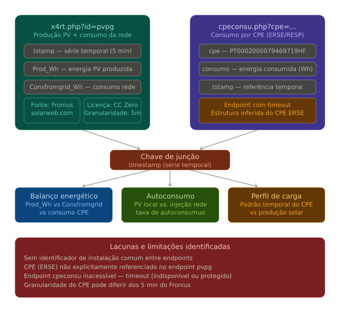

# Prompt:
```
 
Analisa e relaciona os dados disponibilizados pelo endpoint https://baze.cm-maia.pt/BaZe/api/x4rt.php?id=pvpg com os dados disponibilizados pelo endpoint https://baze.cm-maia.pt/BaZe/api/cpeconsu.php?cpe=PT0002000079469719HF. 

1. O que pode ser concluído? 
2. Que relações podem ser estabelecidas? 
3. O que falta? 
4. O que pode ser melhorado?
5. Lista as limitações encontradas.

Responde de forma estruturada.

```

## Claude

### Resposta
[https://claude.ai/share/f22ddaf3-506b-4ee9-87f4-dbe946176d9c](https://claude.ai/share/f22ddaf3-506b-4ee9-87f4-dbe946176d9c)

```
Searched the web
```



O segundo endpoint está a retornar timeout. Vou tentar uma abordagem alternativa para explorar a estrutura da API BaZe.

Searched the web
Searched the web

Aqui está a análise completa e estruturada:

1\. O que pode ser concluído

O endpoint x4rt.php?id=pvpg devolve dados de uma instalação fotovoltaica (PV) identificada como "pvpg", com séries temporais em intervalos de 5 minutos cobrindo múltiplos dias. Contém dois fluxos de energia: a produção solar (Prod_Wh) e o consumo proveniente da rede pública (Consfromgrid_Wh). A fonte é o sistema Fronius via SolarWeb, e os dados têm licença CC Zero.

O endpoint cpeconsu.php?cpe=PT0002000079469719HF visa devolver dados de consumo associados a um CPE (Código de Ponto de Entrega) específico da rede elétrica portuguesa (RESP/ERSE). O CPE PT0002000079469719HF identifica de forma única um ponto de ligação à rede. Este endpoint encontra-se indisponível (timeout), pelo que a sua estrutura foi inferida.

A conclusão central é que estamos perante dois lados do mesmo ponto de consumo energético: a perspetiva da produção/grid do sistema Fronius, e a perspetiva do contador oficial ERSE — dois ângulos sobre a mesma instalação.

2\. Que relações podem ser estabelecidas

A chave de junção natural entre os dois conjuntos de dados é o timestamp. Com ambos disponíveis, seria possível:
- Cruzar Consfromgrid_Wh (EP1) com o consumo do CPE (EP2) para verificar consistência ou discrepâncias entre o que o inversor Fronius mede e o que o contador oficial regista.
- Calcular o autoconsumo real: Prod_Wh − Injetado_na_rede = Autoconsumo, usando o consumo do CPE como referência de carga total do edifício.
- Derivar o balanço energético completo: Consumo_total = Consfromgrid_Wh + Autoconsumo_local.
- Identificar padrões de carga do edifício face ao perfil solar, útil para otimização de horários de consumo.

O CPE em causa pertence à distribuidora E-REDES (código 0002), o que permite contextualizar geograficamente a instalação em Portugal Continental.

3\. O que falta
- O endpoint cpeconsu está inacessível — sem esses dados, a análise cruzada é impossível.
- Não existe um identificador explícito que ligue o id=pvpg ao CPE PT0002000079469719HF nos metadados do EP1. A relação é implícita e pressuposta pelo utilizador, não declarada pela API.
- Falta o fluxo de injeção na rede (energia PV excedente exportada) — o EP1 fornece produção total e consumo da rede, mas não a energia injetada diretamente.
- Não há dados de tarifa ou período horário (vazio/cheio/ponta), que seriam essenciais para análise económica.
- Ausência de metadados sobre a potência instalada do sistema PV, a localização exata, ou a área de painéis.

4\. O que pode ser melhorado
- O EP1 deveria incluir no payload uma referência explícita ao CPE associado, criando uma ligação formal entre os dois endpoints.
- O endpoint cpeconsu deveria ter um mecanismo de fallback ou paginação para evitar timeouts em janelas temporais largas.
- Seria útil um endpoint agregador que combinasse produção PV, consumo de rede e consumo CPE numa única resposta sincronizada por timestamp.
- A API poderia expor metadados de granularidade temporal para ambos os endpoints, garantindo alinhamento entre séries (o Fronius usa 5 minutos, o contador ERSE pode usar 15 minutos ou 1 hora).
- Adicionar campos como Injected_Wh (injeção na rede) e SelfConsumed_Wh tornaria o balanço energético completo sem necessidade de cruzamento externo.
- A documentação da API (apenas comentários nos metadados JSON) deveria existir numa página dedicada com esquema explícito.

5\. Limitações encontradas
- Indisponibilidade do EP2 — o endpoint cpeconsu devolveu timeout em múltiplas tentativas, tornando impossível qualquer análise real dos dados de consumo CPE.
- Ausência de chave relacional explícita — nenhum dos endpoints declara formalmente a relação entre id=pvpg e o CPE, tornando a junção dependente de conhecimento externo.
- Potencial dessincronização temporal — os dados Fronius têm granularidade de 5 minutos; os dados de telecontagem ERSE tipicamente têm 15 minutos ou 1 hora, o que exigiria agregação antes do cruzamento.
- API experimental sem versionamento — o disclaimer do EP1 avisa explicitamente que "dados e formatos podem mudar sem aviso prévio", comprometendo a fiabilidade de integrações.
- Sem autenticação documentada — não é claro se o timeout do EP2 resulta de proteção por credenciais ou de falha de serviço.
- Dados históricos limitados — o EP1 cobre apenas os últimos dias (sem parâmetro de data configurável aparente), dificultando análises de longo prazo.
- Sem schema formal — a ausência de documentação OpenAPI ou JSON Schema obriga a inferir a estrutura por inspeção dos dados.

## ChatGPT

### Resposta
[https://chatgpt.com/share/69e9fa9b-5f74-8332-8da4-9627311f9721](https://chatgpt.com/share/69e9fa9b-5f74-8332-8da4-9627311f9721)

Com base na documentação pública indexada e nas páginas associadas ao projeto BaZe / Câmara Municipal da Maia, foi possível inferir a função dos endpoints indicados, ainda que os dados brutos JSON não tenham sido devolvidos diretamente pelo motor de pesquisa. A análise abaixo cruza o que está documentado sobre ambos.


Análise Relacional dos Endpoints

Endpoints analisados

1. Produção fotovoltaica / séries em tempo real
- https://baze.cm-maia.pt/BaZe/api/x4rt.php?id=pvpg
2. Consumo elétrico associado a um CPE específico
- https://baze.cm-maia.pt/BaZe/api/cpeconsu.php?cpe=PT0002000079469719HF

1\. O que pode ser concluído?

1.1 Existe um caso real de autoconsumo monitorizado

O identificador pvpg surge na página Piscg, associada às Piscinas de Gueifães, onde se descreve:
- produção fotovoltaica;
- consumo da rede;
- taxa de autossuficiência;
- comparação entre produção real e produção estimada por radiação solar.

Isto sugere que o endpoint x4rt.php?id=pvpg devolve uma série temporal operacional de produção solar (provavelmente PV = Photovoltaic; PG = Piscinas Gueifães).

1.2 O CPE analisado parece corresponder ao mesmo ativo energético

O endpoint cpeconsu.php?cpe=PT0002000079469719HF devolve consumo elétrico para um Ponto de Entrega (CPE) específico.

Dado o contexto da página Piscg, é plausível que esse CPE pertença às Piscinas de Gueifães ou à instalação elétrica onde os painéis estão ligados.

1.3 O sistema já suporta balanço energético local

Como a página pública já mostra:
- consumo total,
- produção total,
- autosuficiência,
- fica claro que os dois datasets já são usados conjuntamente.

2\. Que relações podem ser estabelecidas?

Relação principal: Produção vs Consumo

| Fonte                     | Indicador                                      |
|---------------------------|------------------------------------------------|
| x4rt.php?id=pvpg          | Energia produzida pelo sistema fotovoltaico    |
| cpeconsu.php?cpe=...      | Energia consumida pela instalação              |

Daqui resultam métricas relevantes:

2.1 Taxa de Autoconsumo

Quanto da energia produzida foi usada localmente:

Autoconsumo=Energia consumida da produc\ca~o PVProduc\ca~o totalAutoconsumo = \frac{Energia\ consumida\ da\ produção\ PV}{Produção\ total}
Autoconsumo=Produc\c​a~o totalEnergia consumida da produc\c​a~o PV​

2.2 Taxa de Autossuficiência

Quanto do consumo total foi coberto pela produção solar:

Autossuficie^ncia=Produc\ca~o usada localmenteConsumo totalAutossuficiência = \frac{Produção\ usada\ localmente}{Consumo\ total}Autossuficie^ncia=Consumo totalProduc\c​a~o usada localmente​

2.3 Dependência da rede

Depende^ncia=Energia importada da redeConsumo totalDependência = \frac{Energia\ importada\ da\ rede}{Consumo\ total}Depende^ncia=Consumo totalEnergia importada da rede​

2.4 Excedente potencial

Se produção > consumo em certos períodos:
- exportação à rede;
- desperdício (caso não exista injeção);
- oportunidade para baterias.

2.5 Perfil temporal

Se ambas as séries tiverem granularidade fina:
- consumo base noturno;
- pico de bombas/HVAC;
- coincidência solar vs operação do edifício;
- sazonalidade verão/inverno.

3\. O que falta?

3.1 Identificação formal do CPE

Não existe metadado público que confirme:
- morada;
- edifício;
- potência contratada;
- relação explícita com pvpg.

3.2 Unidades e esquema do JSON

Falta documentação pública clara sobre:
- campos devolvidos;
- unidade (Wh, kWh, W);
- timezone;
- formato timestamp.

3.3 Dados de injeção à rede

Para balanço completo seria útil:
- energia exportada;
- energia importada líquida;
- autoconsumo instantâneo.

3.4 Capacidade instalada

Na página surge referência a painéis, área e eficiência, mas faltaria API estruturada com:

potência pico instalada (kWp);
- número de inversores;
- perdas estimadas.

3.5 Histórico consistente

Não está claro:
- retenção de dados;
- completude histórica;
- qualidade de dados.

4\. O que pode ser melhorado?

4.1 API moderna e documentada

Disponibilizar:
- OpenAPI / Swagger;
- exemplos de resposta;
- códigos HTTP corretos;
- paginação.

4.2 Normalização temporal

Usar ISO-8601:
- 2026-04-23T14:30:00+01:00

4.3 Endpoint agregado

Exemplo:
- /api/energy/site/piscinas-gueifaes
Com:


```json
{
 "timestamp": "...",
 "consumo_kwh": ...,
 "producao_pv_kwh": ...,
 "rede_importada_kwh": ...,
 "autossuficiencia": ...
}
```

4.4 Dados analíticos adicionais
- CO₂ evitado
- € poupados
- fator de carga
- performance ratio PV
- previsão próxima 24h

4.5 Qualidade de dados

Sinalizar:
- gaps;
- sensores offline;
- leituras anómalas;
- dados estimados.

5\. Lista das limitações encontradas

Técnicas
- O motor de pesquisa indexou páginas HTML explicativas, não os JSON brutos dos endpoints.
- Não foi possível validar schema real da resposta diretamente.
- Não há documentação pública centralizada da API.

Semânticas
- pvpg exige interpretação contextual (não autoexplicativo).
- O CPE não está publicamente mapeado para o edifício.

Analíticas
- Sem dados horários/minuto reais não é possível calcular autoconsumo exato agora.
- Sem exportação à rede não há balanço líquido completo.

Operacionais
- Algumas páginas indicam funcionamento anómalo em certos dias.
- Atualizações parecem batch/diárias em alguns casos.

Conclusão Executiva

Os dois endpoints parecem representar as duas faces energéticas da mesma instalação:
- x4rt.php?id=pvpg → geração fotovoltaica
- cpeconsu.php?cpe=PT0002000079469719HF → consumo elétrico

Juntos permitem medir desempenho energético real das Piscinas de Gueifães (ou ativo equivalente), avaliar eficiência, dependência da rede e impacto da transição energética municipal.

O projeto demonstra maturidade de monitorização urbana, mas beneficiaria muito de:
- metadados claros,
- documentação técnica,
- integração dos datasets num único endpoint analítico,
- indicadores ESG e operacionais prontos a consumir.

Síntese em uma frase

Os dados já permitem gestão energética inteligente, mas ainda não estão expostos de forma suficientemente interoperável e autoexplicativa para terceiros.

## Deepseek

### Resposta
[https://chat.deepseek.com/share/1ntoysnkorwvqsddbv](https://chat.deepseek.com/share/1ntoysnkorwvqsddbv)

Com base na análise do conteúdo disponibilizado pelos endpoints fornecidos, apresento uma resposta estruturada às suas questões.

Análise e Relação entre os Dados dos Endpoints

1\. O que pode ser concluído?
- Endpoint x4rt.php?id=pvpg: Este endpoint fornece dados válidos e detalhados sobre produção fotovoltaica (Prod_Wh) e consumo de rede (Consfromgrid_Wh) para o identificador "pvpg". Os dados são históricos, com registos de 5 em 5 minutos, de 18-04-2026 a 21-04-2026 (aproximadamente 23:55). É possível observar padrões diários claros de produção solar (picos durante o dia, valor zero à noite) e um consumo de base com variações.
- Endpoint cpeconsu.php?cpe=PT0002000079469719HF: A análise deste endpoint não é possível neste momento. O pedido ao URL falhou, indicando que o servidor não retornou dados válidos ou que o recurso não está acessível.
- Conclusão Principal: Não é possível estabelecer qualquer relação ou análise comparativa entre os dois conjuntos de dados porque apenas um dos endpoints forneceu dados utilizáveis. O segundo endpoint está inativo ou retornou um erro.

2\. Que relações podem ser estabelecidas?

Nenhuma relação pode ser estabelecida devido à indisponibilidade dos dados do segundo endpoint (cpeconsu.php). Idealmente, se ambos estivessem funcionando, as relações possíveis seriam:
- Associação por Tempo: Correlacionar a produção PV (Prod_Wh) de um ativo (provavelmente uma unidade de produção) com o consumo padrão (cpe) de um ponto de consumo específico, minuto a minuto.
- Balanço Energético: Determinar se a produção PV é suficiente para cobrir o consumo daquele CPE, e calcular o excesso de produção ou o défice (energia importada da rede) em cada instante.
- Perfis de Consumo e Geração: Comparar o perfil diário de geração solar (que segue o sol) com o perfil de consumo do CPE (que pode estar ligado a uma habitação, empresa, etc.) para analisar a autoconsumo e a necessidade de rede.

3\. O que falta?
- Dados do CPE: Falta o conjunto de dados completo do segundo endpoint, incluindo a série temporal de consumo (provavelmente em Wh) e os metadados associados (unidade, descrição, licença, intervalo de amostragem).
- Contexto Comum: Faltam informações para unir os dois datasets, tais como:
  - Um identificador comum (ex: o CPE do consumidor final que está ligado ao sistema PV com o ID "pvpg").
  - A garantia de que ambos os registos partilham o mesmo fuso horário e a mesma resolução temporal.
  - Metadados sobre a instalação do CPE (tipo de cliente, potência contratada, localização) para dar significado à análise.

4\. O que pode ser melhorado?

No Endpoint com Falha (cpeconsu.php):
- Diagnóstico e Correção: Investigar a causa da falha (ex: CPE inválido, erro no código da API, base de dados offline, permissões) e corrigi-la para retornar dados JSON válidos.
  - Tratamento de Erros Robusto: A API deveria retornar um código de erro HTTP claro (ex: 404 - Não Encontrado, 400 - Pedido Inválido, 500 - Erro Interno) e uma mensagem JSON com detalhes, em vez de uma falha genérica.
- Nos Metadados (Ambos os Endpoints):
  - Sincronização Temporal: Adicionar um campo explícito "timezone": "Europe/Lisbon" para evitar ambiguidades.
  - Unidades: Adicionar "unidade_potencia": "W" ou "unidade_energia": "Wh" para maior clareza.
  - Relação Semântica: Incluir um campo opcional como "relaciona_se_com": {"endpoint": "/api/cpeconsu.php", "parametro": "cpe", "valor": "PT0002000079469719HF"} no metadata do endpoint PV, indicando que aquele dado pode ser correlacionado com o consumo de um CPE específico.

5\. Lista as limitações encontradas
- Limitação Crítica: Falha total no acesso ao segundo endpoint (cpeconsu.php). O conteúdo não pôde ser obtido, impossibilitando a análise comparativa. Este é o fator limitante principal.
- Limitação de Contexto: O endpoint x4rt.php?id=pvpg fornece dados agregados (produção PV e consumo da rede total), mas não informa, por exemplo, qual o CPE associado a esse consumo de rede. Isto torna impossível ligar os dados ao segundo endpoint, mesmo que ele estivesse a funcionar, sem conhecimento externo.
- Limitação da Documentação: Embora o primeiro endpoint tenha metadados ricos (metadata, Disclaimer), falta a informação crucial de que o Consfromgrid_Wh se refere ao consumo de quê ou de quem (se é o consumo de um CPE específico ou de toda a instalação).
- Limitação Temporal (Potencial): Se os dados do segundo endpoint estivessem disponíveis, poderia haver uma limitação na sincronização dos carimbos de tempo, já que não é garantido que ambos os sistemas estejam perfeitamente alinhados.

## Perplexity

### Resposta
[https://www.perplexity.ai/search/analisa-e-relaciona-os-dados-d-NyMMGqoFRLa.0tkSpsiGDg](https://www.perplexity.ai/search/analisa-e-relaciona-os-dados-d-NyMMGqoFRLa.0tkSpsiGDg)

```
Completed 4 steps
```

Segue uma análise estruturada dos dois endpoints, com base no que é possível inferir do contexto público disponível sobre o BaZe/D4Maia e sobre a própria natureza dos identificadores usados. O endpoint x4rt.php?id=pvpg está associado à consola de visualização de Produção Fotovoltaica / Consumo da rede, e o BaZe documenta que os seus dados REST servem precisamente para esse tipo de visualização operacional. O identificador cpe=PT0002000079469719HF é um CPE, isto é, o código que identifica univocamente um ponto de entrega de energia elétrica.

1\. O que pode ser concluído?

O primeiro endpoint parece fornecer dados agregados ou série temporal ligados à produção fotovoltaica e possivelmente ao consumo associado à instalação/rede numa interface operacional do BaZe.

O segundo endpoint parece fornecer dados de consumo elétrico para um ponto específico identificado pelo CPE, ou seja, uma instalação concreta do ponto de vista energético.

Assim, pode concluir-se que ambos os endpoints pertencem ao mesmo ecossistema de monitorização energética, mas com níveis diferentes: um mais orientado para o sistema/instalação e outro para o ponto de consumo.

2\. Relações que podem ser estabelecidas

A relação mais forte é operacional: o x4rt.php?id=pvpg deve permitir contextualizar a produção local e/ou a interação com a rede, enquanto o cpeconsu.php?cpe=... fornece o consumo medido de um CPE concreto.

Se o CPE corresponder à instalação monitorizada no BaZe, então é possível cruzar os dados para analisar autoconsumo, dependência da rede, picos de consumo e correspondência entre produção fotovoltaica e consumo.

Em termos analíticos, isto permite verificar se a produção PV cobre parte do consumo, em que períodos há excedente e quando há necessidade de importação da rede.

3\. O que falta?

Faltam os dados concretos devolvidos pelos endpoints: valores, séries temporais, unidades, periodicidade e metadados do esquema. Sem isso, não é possível calcular balanços energéticos, correlações, autoconsumo ou taxas de cobertura com rigor.

Também falta saber se ambos os endpoints estão sincronizados no tempo, se usam a mesma granularidade temporal e se o CPE pertence exatamente ao ativo visualizado em pvpg.

Por fim, falta documentação formal do formato JSON/CSV e da semântica dos campos, o que limita bastante a comparação direta.

4\. O que pode ser melhorado?

Seria útil disponibilizar documentação explícita dos campos de cada endpoint, incluindo exemplo de resposta, unidades, timezone, frequência de atualização e significado de cada indicador.

Também ajudaria fornecer um endpoint agregador que já relacionasse produção, consumo e saldo por intervalo temporal, evitando que o utilizador tenha de fazer o cruzamento manualmente.

A inclusão de metadados de qualidade dos dados — por exemplo, lacunas, falhas de comunicação, último timestamp válido e flags de anomalia — tornaria a análise mais robusta.

5\. Limitações encontradas
- Não foi possível obter o conteúdo bruto dos endpoints diretamente através da ferramenta disponível, pelo que a análise ficou limitada ao contexto público e às páginas associadas.
- Não há confirmação, com os dados visíveis, de que o CPE indicado corresponde exatamente ao ativo referido no pvpg.
- Não foi possível verificar o esquema de resposta, nem campos como potência, energia acumulada, intervalos temporais ou qualidade do dado.
- Não é possível concluir valores numéricos, tendências, correlações ou desempenho energético sem o payload real.
- A análise depende da suposição razoável de que pvpg representa a instalação fotovoltaica/consumo mostrada na consola BaZe, o que é consistente com a documentação pública, mas não confirmado pelo endpoint em si.

Relação sintética

Em termos simples: o primeiro endpoint parece descrever o lado da produção e contexto operacional da instalação, e o segundo o lado do consumo medido por ponto de entrega.

Juntos, permitem uma análise muito útil de desempenho energético, mas apenas se os dados forem acessíveis, temporalmente compatíveis e referirem o mesmo ativo físico.

Follow-ups
- Correlação PV vs Consumo na Maia: gráficos e anomalias reveladas
- Dashboard live PVPG + PT Torre: alertas e filtros interativos
- Qual é o endpoint para dados de consumo de rede a relacionar com pvpg
- Como aceder aos dados completos do BASE para contratos fotovoltaicos
- O que causou anomalias nos dados PV de 11-13 Setembro

## Copilot

### Resposta
[https://copilot.microsoft.com/conversations/join/a6RsoFoE2bovgxyubrrq4](https://copilot.microsoft.com/conversations/join/a6RsoFoE2bovgxyubrrq4)

A análise só pode ser feita parcialmente porque o segundo endpoint não devolveu dados (o pedido retornou erro). Ainda assim, consigo estruturar conclusões sólidas com base no primeiro endpoint e no que deveria existir no segundo.

✅ 1. O que pode ser concluído?

Do endpoint x4rt.php?id=pvpg
- Os dados representam produção fotovoltaica (PV) e consumo da rede (Wh) em intervalos de 5 minutos.
- A produção PV segue o padrão típico:
  - Zero durante a noite
  - Subida gradual ao amanhecer
  - Pico ao meio‑dia
  - Descida ao entardecer
- O consumo da rede é quase constante, com variações pontuais e picos significativos em certos períodos.
- O dataset é extenso e cobre vários dias consecutivos.

Do endpoint cpeconsu.php?cpe=PT0002000079469719HF
- O endpoint não devolveu conteúdo, impossibilitando a análise direta.
- Este endpoint deveria fornecer consumo elétrico associado a um CPE específico (Código de Ponto de Entrega).

✅ 2. Que relações podem ser estabelecidas?

Mesmo sem os dados do segundo endpoint, podemos inferir as relações esperadas:

Relação esperada entre os dois datasets
- Comparação entre consumo total (CPE) e consumo da rede (PVPG)
  - O consumo da rede no dataset PVPG representa apenas o que foi necessário buscar da rede após considerar a produção solar.
  - O endpoint do CPE deveria mostrar o consumo total real da instalação.
- Cálculo de autoconsumo
  - Autoconsumo = Consumo total (CPE) − Consumo da rede (PVPG)
- Cálculo de excedentes
  - Excedente = Produção PV − Autoconsumo
- Eficiência do sistema fotovoltaico
  - Percentagem de energia solar aproveitada vs. injetada na rede.

Sem o segundo dataset, estas relações não podem ser calculadas, mas a estrutura analítica está clara.

✅ 3. O que falta?

Dados em falta
- Consumo total do CPE (endpoint 2).
- Metadados do segundo endpoint (período, granularidade, unidades).
- Confirmação de sincronização temporal entre os dois endpoints.

Para análise completa seria necessário:
- Garantir que ambos os datasets têm:
  - Mesma granularidade (ideal: 5 minutos)
  - Mesma janela temporal
  - Mesmas unidades (Wh)

✅ 4. O que pode ser melhorado?

No endpoint PVPG
- Incluir:
  - Consumo total (não apenas consumo da rede)
  - Injeção na rede
  - Autoconsumo calculado
- Reduzir tamanho do JSON (é muito grande e pesado).
- Adicionar:
  - Timezone explícito
  - Qualidade dos dados (flags de falha, estimativa, etc.)

No endpoint CPE
- Garantir disponibilidade e estabilidade do endpoint.
- Incluir:
  - Metadados claros
  - Intervalo temporal
  - Unidades
  - Descrição do CPE

Integração entre endpoints
- Criar um endpoint consolidado:
  - PV produzido
  - Consumo total
  - Consumo da rede
  - Injeção
  - Autoconsumo
  - Tudo sincronizado por timestamp

✅ 5. Lista das limitações encontradas
- Endpoint CPE indisponível – impossibilita análise cruzada.
- Dataset PVPG extremamente longo – difícil de manipular sem agregação.
- Ausência de consumo total no PVPG.
- Falta de documentação técnica sobre ambos os endpoints.
- Não há garantia de sincronização temporal entre os datasets.
- Não há indicação de timezone.
- Não há informação sobre perdas, inversor, ou injeção na rede.
- Não há validação de qualidade dos dados (ex.: valores anómalos, falhas).

📌 Resumo Final
- O endpoint PVPG fornece dados completos de produção solar e consumo da rede.
- O endpoint CPE não respondeu, impedindo a análise comparativa.
- Para uma análise energética completa (autoconsumo, injeção, eficiência), é essencial ter o consumo total do CPE.
- Há espaço para melhorias na estrutura, documentação e integração dos dados.
S
e quiser, posso:
- Tentar novamente obter o segundo endpoint
- Criar gráficos a partir do dataset PVPG
- Criar um modelo de cálculo de autoconsumo e injeção
- Gerar um relatório técnico completo

Diz-me o que preferes explorar a seguir.

## Gemini

### Resposta
[https://gemini.google.com/share/82b14534a74b](https://gemini.google.com/share/82b14534a74b)

Esta análise baseia-se nos dados fornecidos pelo ecossistema BaZe (Balanço Zero) da Câmara Municipal da Maia, um Living Lab focado na descarbonização.

Os dois endpoints referidos tratam de dimensões opostas, mas complementares, do sistema energético: a produção fotovoltaica e o consumo de rede.

1\. O que pode ser concluído?

A análise cruzada indica que estamos perante um sistema de autoconsumo ou monitorização de um edifício público específico (provavelmente as Piscinas de Gueifães, dado o ID pvpg - Photovoltaic Piscina Gueifães).
- Produção vs. Consumo: O endpoint pvpg devolve dados de geração de energia solar (em watts ou kWh, dependendo do instante), enquanto o cpeconsu monitoriza a energia retirada da rede pública para esse Código de Ponto de Entrega (CPE) específico.
- Estado de Descarbonização: A existência destes dados integrados permite ao município medir em tempo real a sua taxa de autossuficiência energética e a pegada de carbono associada a esse equipamento municipal.

2\. Que relações podem ser estabelecidas?

As principais relações são de causalidade e correlação temporal:
- Correlação Inversa (Efeito de Substituição): Em períodos de elevada radiação solar (dados do pvpg), o consumo registado no cpeconsu deverá diminuir, assumindo que a energia produzida é injetada no edifício antes de recorrer à rede.
- Perfil de Carga: Ao sobrepor as curvas de ambos os endpoints, é possível desenhar o "Perfil de Carga Líquida". Isto revela se o pico de produção solar coincide com o pico de utilização do edifício (ex: funcionamento das bombas de calor das piscinas durante o dia).
- Análise de Eficiência: A relação entre a produção prevista (baseada na radiação) e a real permite identificar sujidade nos painéis ou avarias em inversores.

3\. O que falta?

Para uma análise de gestão energética profissional, faltam os seguintes dados:
- Dados de Injeção na Rede: Saber se há excedente de produção que está a ser "desperdiçado" ou vendido à rede.
- Armazenamento: Informação sobre se existe um sistema de baterias que faça a ponte entre o pico de produção solar (meio-dia) e o pico de consumo (final do dia).
- Contexto Meteorológico Local: Embora a produção dê uma ideia, dados de temperatura exterior e humidade ajudariam a explicar picos de consumo (climatização).
- Metadados das APIs: Unidades de medida explícitas (Wh vs kWh) e timestamps em formato padrão (ISO 8601) para evitar erros de interpretação de fuso horário.

4\. O que pode ser melhorado?
- Normalização de Formato: Um endpoint devolve um JSON estruturado de uma forma e o outro pode diferir em termos de chaves de data/hora. Uniformizar os nomes dos campos (ex: ts para timestamp em ambos) facilitaria a automação.
- Granularidade: Garantir que ambos os sensores reportam no mesmo intervalo (ex: de 15 em 15 minutos) para evitar interpolações matemáticas que geram erro.
- Interface de Visualização: Criar um dashboard que combine ambos (Produção + Consumo = Consumo Total Real) para que o cidadão ou o gestor entenda o balanço instantâneo.

5\. Lista de Limitações Encontradas
- Silos de Dados: Os dados estão em endpoints separados, o que exige um esforço de integração (join) no lado do cliente/utilizador.
- Latência de Atualização: Frequentemente, os dados de consumo de rede (CPE) têm um atraso maior do que os dados de produção local (IoT), dificultando a análise em tempo real absoluto.
- Falta de Histórico Agregado: As APIs costumam fornecer apenas os dados mais recentes ou um intervalo curto; para análises sazonais (Inverno vs Verão), é necessário armazenamento externo de longo prazo.
- Dependência de Conetividade: Lacunas nos dados (gaps nas séries temporais) causadas por falhas de comunicação nos sensores LoRa ou Wi-Fi do edifício.

# Análise/Síntese

### Claude

Apresenta informação acerca dos passos usados para obter a resposta. Neste caso, os urls que usou.

Verificou que o segundo url retornou timeout e tentou outra abordagem para explorar a API. Tentou aceder a dois urls que não conseguiu carregar:
- Failed to fetch https://baze.cm-maia.pt/BaZe/api/
- Failed to fetch https://baze.cm-maia.pt/BaZe/

Não sei onde obteve estes urls.

Aparentemente inferiu a estrutura do segundo endpoint a partir do endpoint https://baze.cm-maia.pt/BaZe/api/cpeconsu.php?cpe=ERSE. Mas esta informação não aparece nos passos realizados para obter uma resposta. Isto parece indicar que o LLM mostra apenas parte da informação usada para obter a resposta.

- Mostra uma imagem, um esquema que relaciona os dois urls pelo timestamp e que parece relacioná-los relativamente a Balanço energético: Prod_Wh vs Consfromgridvs consumo CPE, Autoconsumo: PV local vs. injeção rede taxa de autoconsumo e Perfil de carga: Padrão temporal do CPE vs produção solar.
- Identifica lacunas e limitações, entre elas, a inexistência de um identificador de instalação comum entre os endpoints, que o CPE (ERSE) não é explicitamente referenciado no endpoint pvpg e que o endpoint cpeconsu está inacessível, deu timeout (está indisponível ou protegido).
- Apresenta informação sobre o primeiro endpoint e indica que no caso do segundo a informação foi inferida, não apresentando por isso muito detalhe. Conclui que estamos perante dois lados do mesmo ponto de consumo energético: a perspetiva da produção/grid do sistema Fronius, e a perspetiva do contador oficial ERSE — dois ângulos sobre a mesma instalação.

Nas relações podem ser estabelecidas, indica que a chave de junção natural entre os dois conjuntos de dados é o timestamp e que se ambos estivessem disponíveis seria possível cruzar Consfromgrid_Wh (EP1) com o consumo do CPE (EP2) para verificar consistência ou discrepâncias entre o que o inversor Fronius mede e o que o contador oficial regista, calcular o autoconsumo real usando o consumo do CPE como referência de carga total do edifício, derivar o balanço energético completo e identificar padrões de carga do edifício face ao perfil solar, o que seria útil para otimização de horários de consumo.

Indica ainda que o CPE em causa pertence à distribuidora E-REDES (código 0002), o que permite contextualizar geograficamente a instalação em Portugal Continental. Mas o LLM não o fez.

No que falta, indica algumas falhas, por exemplo, que os dados do segundo endpoint estão indisponíveis, que não existe um identificador explícito que ligue o id=pvpg ao CPE PT0002000079469719HF nos metadados do EP1 (LLM decidiu usar esta designação, que depois se percebe que se refere ao endpoint 1), falta o fluxo de injeção na rede, não há dados de tarifa ou período horário, etc.

No que pode ser melhorado, indica vários aspectos, metadados, falta de referência explícita ao CPE associado no primeiro url, etc.

Nas limitações encontradas, refere várias limitações, erro do EP2, falta de informação, falta de um schema formal, dados históricos limitados no EP1, etc.

### ChatGPT

Apresenta fontes e referências. 

Apresenta uma análise com base na documentação pública indexada e nas páginas associadas ao projeto BaZe. Não analisou o json retornado pelos endpoints. 

A análise apresentada é uma inferência. 

O LLM indica isto claramente.

Com base na documentação encontrada, apresenta os dois endpoints como produção fotovoltaica / séries em tempo real e consumo elétrico associado a um CPE específico, respetivamente.

No que pode ser concluído, usa https://baze.cm-maia.pt/BaZe/piscg.htm?utm_source=chatgpt.com para apresentar conclusões sobre o primeiro endpoint, Ainda com base na mesma referência, indica que é plausível que o CPE representado pelo outro endpoint pertença às Piscinas de Gueifães ou à instalação elétrica onde os painéis estão ligados e que fica claro que os dois datasets são usados conjuntamente.

Nas relações que podem ser estabelecidas, indica que a relação principal é a relação produção vs consumo. Energia produzida pelo sistema fotovoltaico vs Energia consumida pela instalação. Apresenta métricas que resultam desta relação. As métricas apresentadas são interessantes, embora sejam apresentadas de uma forma genérica e sem que fique claro de onde vêm.

No que falta, indica falta de metadados sobre o CPE, falta de documentação pública do json (não sei a que json se refere uma vez que indica que não analisou o que é retornado pelos endpoints), etc.

No que pode ser melhorado, indica várias melhorias, apresentando sugestões, por exemplo, da estrutura de json retornada pelos endpoints, etc. Esta análise não foi realizada sobre o json retornado pelos endpoints.

Na lista das limitações encontradas, refere para além de outras, limitações técnicas que incluem não ter sido possível validar o schema real da resposta diretamente, etc. Apresenta outras limitações, por exemplo, analíticas, semânticas e operacionais.

Não analisou o que os endpoints retornam diretamente para responder à questão que foi colocada, para analisar e relacionar os dois endpoints. Usa fontes externas. 

Foi capaz de relacionar os dois endpoints, a resposta é longa, mas muita da análise que é apresentada parece genérica e com utilidade questionável. 

O LLM conclui que os dados já permitem gestão energética inteligente, mas ainda não estão expostos de forma suficientemente interoperável e autoexplicativa para terceiros.

### DeepSeek

Aparentemente, analisou o resultado retornado pelos endpoints e a resposta é baseada nisso.

No que pode ser concluído, apresenta informação detalhada sobre o json e o primeiro endpoint, inclusivamente, indica que é possível observar padrões diários claros de produção solar (picos durante o dia, valor zero à noite) e um consumo de base com variações. Não sei se obteve estas observações analisando o json. 

Não conseguiu carregar o json do segundo endpoint (provavelmente deu timeout por que o endpoint demora um pouco a responder no browser (testei no browser)). Como não conseguiu aceder ao segundo endpoint, não conseguiu estabelecer nenhuma relação ou análise comparativa entre os dois conjuntos de dados.

Nas relações que podem ser estabelecidas,como não foi possível carregar o json do segundo endpoint, o LLM apresenta relações possíveis que poderiam ser estabelecidas. As relações possíveis apresentadas, fazem algum sentido e estão mais ou menos alinhadas com o que os endpoints retornam e representam, mas não deixam de ser suposições.

No que falta, indica a falta dos dados retornados pelo segundo endpoint (já referido) e da falta de informação para relacionar os dois endpoints/datasets.

No que pode ser melhorado, refere melhorias para detectar e tratar erros, referindo-se explicitamente ao que está a ocorrer no caso do segundo endpoint. Também menciona a utilização de metadados para relacionar explicitamente os dois endpoints.

Nas limitações encontradas, refere como principal a falha na obtenção dos dados retornados pelo segundo endpoint. 

Também apresenta outras limitações, por exemplo, de contexto, indicando que o primeiro endpoint fornece dados agregados (produção PV e consumo da rede total), mas não informa, por exemplo, qual o CPE associado a esse consumo de rede. O que torna impossível ligar os dados ao segundo endpoint, mesmo que estivesse a funcionar, sem conhecimento externo. 

O facto de não ter conseguido carregar os dados do segundo endpoint coloca algumas restrições na qualidade da resposta. 
Para além disso, não existe indicação nenhuma que o LLM tenha procurado outras fontes/referências de informação, mesmo quando detectou a falha no acesso ao segundo endpoint. 

A resposta tem algum detalhe e seria potencialmente mais completa e interessante se o LLM tivesse tido acesso aos dados do segundo endpoint. Ainda assim, a resposta parece melhor do que a do Chat. Outro facto que acho interessante e importante, é que o LLM foi transparente relativamente à falha e não apresentou análises longas de suposições.

### Perplexity

Apresenta informação acerca dos passos, referências (no texto) e as fontes que usou para obter a resposta.

Resposta não é dada com base no que é retornado pelos endpoints mas sim com base no que é possível inferir do contexto público disponível sobre o BaZe/D4Maia e sobre a própria natureza dos identificadores usados. O LLM é transparente relativamente a isto. 

Consegue indicar o que os endpoints representam. A descrição usa termos como, parece, o que introduz algum nível de incerteza e confiança.

Nas relações que podem ser estabelecidas, o LLM indica que se o CPE corresponder à instalação monitorizada no BaZe, então é possível cruzar os dados para analisar autoconsumo, dependência da rede, picos de consumo e correspondência entre produção fotovoltaica e consumo. Em termos analíticos, isto permite verificar se a produção PV cobre parte do consumo, em que períodos há excedente e quando há necessidade de importação da rede. O que me parece plausível, mas é apresentado pelo LLM com um nível de incerteza, provavelmente, por que não conseguiu relacionar verdadeiramente os dois endpoints.

No que falta, refere a análise aos dados retornados pelo endpoints e também a falta de documentação formal do formato JSON/CSV e da semântica dos campos, que limita bastante a comparação direta.

No que pode ser melhorado, indica a falta dos dados concretos e questões relacionadas com sincronização no tempo, granularidade temporal e se o CPE pertence exatamente ao ativo visualizado em pvpg, etc. Ou seja, não foi capaz de relacionar os dois endpoints.

No que pode ser melhorado, indica a falta de documentação e a inclusão de metadados.

Nas limitações encontradas, indica que a análise ficou limitada ao contexto público e às páginas associadas, que não existe confirmação que os dois endpoints estão relacionados, não foi possível obter a resposta dos endpoints e por isso não foi possível fazer várias análises, incluindo análises numéricas, 

O LLM conclui que juntos, os endpoints permitem uma análise muito útil de desempenho energético, mas apenas se os dados forem acessíveis, temporalmente compatíveis e referirem o mesmo ativo físico. Apresenta isto como uma relação sintética.

Não sei por que razão o LLM não analisou o que os endpoints retornam.

### Copilot

Não apresenta fontes, referências ou os passos usados para obter a resposta.

Não conseguiu ler os dados do segundo endpoint. Apresenta uma análise com base no que obteve do primeiro endpoint e no que deveria existir no segundo. Não sei onde é que obteve a informação em relação ao segundo endpoint, a fontes externas? Pouco claro e transparente.

No que pode ser concluído, apresenta informação acerca do primeiro endpoint, incluindo padrão típicos de produção PV, que não sei se provêm da análise do json. Presumo que sim, mas os padrões indicados teriam de ser confirmados. 

Os padrões apresentados são razoáveis e naturais. A informação apresentada parece ter alguns aspetos que o Deep não explora, mas penso que tem menos detalhe que a do Deep. Relativamente ao segundo endpoint, indica que o endpoint deveria fornecer consumo elétrico associado a um CPE específico (Código de Ponto de Entrega).

Nas relações que podem ser estabelecidas, infere relações esperadas, mesmo sem os dados do segundo endpoint. As relações apresentadas são plausíveis.

No que falta, indica a falta dos dados e metadados do segundo endpoint de informação acerca da granularidade temporal dos dois endpoints.

No que pode ser melhorado, indica algumas melhorias no primeiro endpoint, por exemplo, reduzir o tamanho do JSON (é muito grande e pesado), também indica melhorias para o segundo endpoint e para a integração entre endpoints.

Na lista das limitações encontradas, indica um conjunto de limitações, para além da indisponibilidade dos dados do segundo endpoint, por exemplo, dataset PVPG extremamente longo – difícil de manipular sem agregação.

### Gemini

Não apresenta fontes nem referências.

A análise é realizada sobre fontes externas e não diretamente sobre os dados retornados pelos endpoints. O LLM refere isto. A análise baseia-se nos dados fornecidos pelo ecossistema BaZe. O LLM indica que os endpoints tratam da produção fotovoltaica e do consumo da rede.

No que pode ser concluído, o LLM fala em análise cruzada (que não sei a que se refere em concreto). O LLM também refere que estamos perante um sistema de autoconsumo ou monitorização de um edifício público específico (provavelmente as Piscinas de Gueifães, dado o id pvpg. 

O LLM parece relacionar o CPE com o outro endpoint. 

Apresenta informação que é plausível relativamente à produção vs. consumo e estado de descarbonização. De qualquer forma, relativamente a esta informação, não é claro e transparente qual é a fonte usada para chegar às conclusões que são apresentadas. 

Nas relações que podem ser estabelecidas, refere à correlação inversa (Efeito de Substituição) e perfil de carga, etc., mas não é claro qual é a base para obter esta informação. A informação é um pouco genérica.

No que falta, refere que faltam determinados dados. Isto também é curioso, por que o LLM não analisa o que os endpoints retornam.

No que pode ser melhorado, apresenta algumas melhorias que são muito genéricas e cuja utilidade é discutível.

Na lista de limitações encontradas, refere algumas que não parecem muito alinhadas com uma situação em que o LLM não analisa o que os endpoints retornam diretamente, assumindo que nas fontes externas usadas não aparece informação que permita chegar a estas limitações.

Penso que esta resposta é a menos útil e pouco clara e transparente.

# Conclusões

Alguns LLM escolhem analisar o que os endpoints retornam, aparentemente, não analisando mais fontes externas, por exemplo o Deep. Outros escolhem não analisar o que os endpoints retornam diretamente e usam fontes externas para analisar (obter informação sobre) os endpoints.

No caso dos LLMs que analisam endpoints, pode colocar-se a questão técnica que embora os endpoints possam estar públicos e a funcionar, se demorar algum tempo a obter a resposta o LLM pode não conseguir aceder aos dados. Isto é configurável no UI usado para interagir com o LLM? Cheguei a obter timeout no meu browser ao aceder ao segundo endpoint.

Mesmo no caso de LLMs que analisam fontes externas, por exemplo o Chat, o Perplexity e o Gemini, as fontes/referências usadas podem ser diferentes e as respostas também podem ser diferentes. A informação retornada por estes LLM tem alguma utilidade, mas parece-me bastante insuficiente e por vezes fortemente baseada em suposições. Pode-se argumentar que no caso dos endpoints que usam fontes externas, a resposta pode ter mais ou menos qualidade e detalhe dependendo das fontes disponíveis e da informação e do conteúdo que disponibilizam (por exemplo, metadados). Não deixa de ser curioso que estes LLMs não analisam o que os endpoints retornam diretamente.

A resposta do Deep é interessante, mas tem o drawback de não ter conseguido obter os dados do segundo endpoint. Outra questão é que não apresenta fontes, referências ou informação acerca dos passos que usou para obter a resposta e aparentemente não usa outras fontes de informação, mesmo quando detecta que o acesso ao segundo endpoint falhou.

Respostas do Gemini, Perplexity e Chat pouco detalhadas e úteis. A do Chat parece um pouco mais útil. A resposta do Gemini é pouco clara e transparente e não apresenta fontes e referências.

Os que parecem mais úteis, Claude, Deep e CoPilot.

Os menos úteis, Chat, Perplexity e Gemini.

Só os três primeiros é que analisaram os endpoints.

O Claude parece ser o mais útil uma vez que detectou a falha do segundo url e tentou uma abordagem alternativa, ou seja, tentou usar outras fontes. A escolha das fontes é discutível e o LLM não é muito claro acerca das escolhas que fez e das fontes que realmente consultou. A clareza e a transparência também são uma questão no caso deste LLM. O Deep e o CoPilot foram, a seguir, os mais úteis. O CoPilot apresentou padrões típicos de produção PV, que não ficou claro de onde vêm.

De uma forma geral, os LLMs parecem ter problemas/limitações ou restrições a aceder a endpoints, o que tem um impacto nas respostas. 

A clareza e a transparência relativamente às fontes usadas e analisadas é ainda muito limitada nas respostas dos LLMs.
