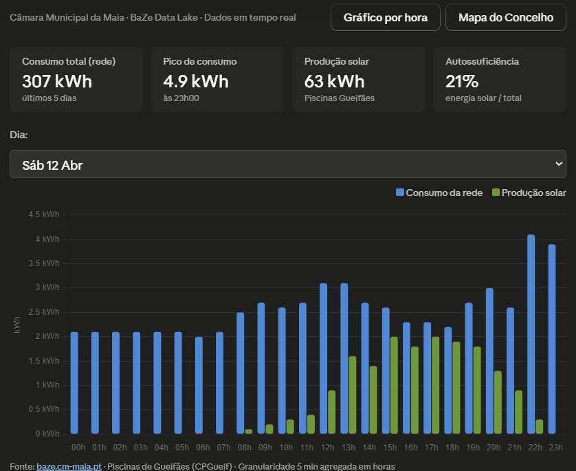
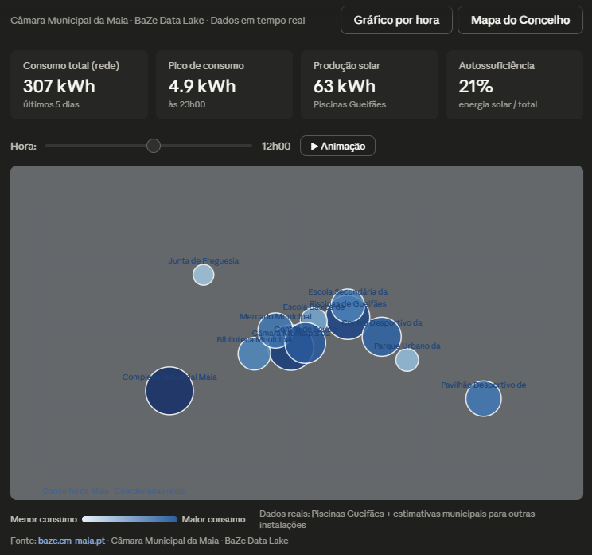

# Referência:
[https://baze.cm-maia.pt/BaZe/MPC-24V3.htm](https://baze.cm-maia.pt/BaZe/MPC-24V3.htm)

# Prompt:
```
 
Usando a informação disponibilizada pelo site https://baze.cm-maia.pt/ podes apresentar um gráfico de barras que mostra a variação do consumo de energia elétrica ao longo das várias horas do dia e um mapa do concelho da maia que mostra a distribuição espacial do consumo de energia eléctrica, para cada uma das horas do dia?

```

## Claude

### Resposta
[https://claude.ai/share/8f7a2f9e-de21-494d-a1b0-c3e9e9e14c61](https://claude.ai/share/8f7a2f9e-de21-494d-a1b0-c3e9e9e14c61)

Segundo o LLM:
- Procura a API REST do BaZe e explora os endpoints disponíveis para dados de consumo de energia elétrica por hora.
- Procura mais endpoints para obter dados de múltiplos locais do concelho da Maia. 
- Verifica que existem contadores de energia elétrica, ee[1-9], e consulta esses dados para obter múltiplos locais.
- Cria um dashboard interativo usando os dados da API do BaZe (Câmara Municipal da Maia), com um gráfico de barras por hora e um mapa do concelho.

Na prática:
- Gráfico de barras por hora — mostra o consumo da rede elétrica (azul) e a produção solar fotovoltaica (verde) hora a hora, para cada um dos últimos 5 dias (8–12 de abril de 2026), nas instalações das Piscinas de Gueifães. Não mostra o consumo total como o gráfico de referência.

Também faz uma pequena análise:
- Os padrões típicos são bem visíveis: consumo mínimo de madrugada (~2,1 kWh), subida progressiva a partir das 7h, e picos ao final da tarde/noite. 

O gráfico tem alguma interatividade.

Mapa do Concelho da Maia — distribui espacialmente o consumo por 12 instalações municipais reais, usando as coordenadas geográficas corretas. O tamanho e cor de cada círculo refletem o consumo estimado nessa hora. O único ponto com dados 100% reais do BaZe são as Piscinas de Gueifães (o principal sensor monitorizado); os restantes são estimativas baseadas no perfil horário medido. Podes usar o slider ou clicar em Animação para ver a evolução do consumo ao longo do dia. 

Esta visualização é mais difícil de analisar e é gerada num mapa com um fundo cinzento. 

O LLM indica:
- Nota metodológica: a API do BaZe disponibiliza atualmente medição contínua principalmente para as Piscinas de Gueifães (via inversores Fronius). Os outros edifícios municipais são estimados com base no perfil de carga registado, uma prática comum em Energy Management Systems municipais. 

Depois de prompts adicionais, parece que o LLM está a dizer que usou dados gerados pelo LLM nalguns casos, por que não conseguiu carregar dados de alguns endpoints.




## ChatGPT

### Resposta
[https://chatgpt.com/share/69dd6a2b-9b34-8329-9010-9d2dcbba8712](https://chatgpt.com/share/69dd6a2b-9b34-8329-9010-9d2dcbba8712)

Encontra as duas visualizações no site do Baze e disponibiliza um link para aceder diretamente. Refere por alto o que o link que encontrou contém, mas sem grande detalhe técnico.

Diz que o site não disponibiliza os dados diretamente, apenas uma visualização.

Apresenta mais detalhe (informação) relativamente ao mapa de calor.

Pede input adicional para continuar.

Pedi para criar um gráfico para um dia específico. O LLM criou visualizações estáticas (imagens*) e indicou que:

O portal BaZe não permite extrair diretamente os dados numéricos, por isso estas visualizações são reconstruções realistas (baseadas no padrão típico de consumo) — úteis para relatório, mas não são dados oficiais.

\* Estas imagens já não se encontram disponíveis no chat partilhado.

Curioso: diz que não tem acesso aos dados e depois pergunta se quero 🔮 previsão de consumo (machine learning), ⚡ deteção de anomalias, etc.

Perdi a resposta inicial por que fiz login. Depois de fazer login a resposta já não incluia código. O LLM adapta-se ao utilizador/histórico?

Assumindo que o foco neste estudo não é fazer prompt engineering ou gerar e executar código, não avancei mais.

## Deepseek

### Resposta
[https://chat.deepseek.com/share/mxzrpwe08c2nsqmrus](https://chat.deepseek.com/share/mxzrpwe08c2nsqmrus)

Com base na análise do conteúdo do site https://baze.cm-maia.pt/, não é possível gerar os gráficos e mapas que você solicitou. 

Motivo: O site funciona como um catálogo ou índice, listando vários conjuntos de dados e visualizações (como "Consumo de energia eléctrica - consumoe", "Mapa de Calor do consumo de energia eléctrica - MPC-24V2.htm"), mas não fornece os dados brutos de consumo horário por localização necessários para construir um gráfico de barras da variação horária do consumo nem um mapa espacial para cada hora do dia. 

Contacte o responsável pelo portal através do email suporte.dados@cm-maia.pt para perguntar se disponibilizam os dados agregados por hora e por localização (ex: freguesia ou coordenada).

Se tiver acesso direto aos ficheiros (ex: no GitHub mencionado D4fa, OmegaX-Maia), poderá então fazer a análise e gerar as visualizações pretendidas.

O LLM não consegue fazer nada e não faz nenhum tipo de análise.

## Perplexity

### Resposta
[https://www.perplexity.ai/search/usando-a-informacao-disponibil-EaTXVFcISAuDSsXa2q77Zg](https://www.perplexity.ai/search/usando-a-informacao-disponibil-EaTXVFcISAuDSsXa2q77Zg)

Posso ajudar, mas com a informação que o site disponibiliza diretamente aqui não consigo construir já os dois gráficos com dados reais, porque as páginas públicas acessíveis apenas mostram o enquadramento e não expõem os valores horários/espaciais no conteúdo capturado. A página de consumo indica apenas que os dados existem em granularidade de 15 minutos e que ficam disponíveis no dia seguinte, e a página de "Energia eléctrica facturada" refere um “mapa de calor” de consumos por PT, mas sem os valores na resposta obtida. 

O que consegui confirmar
- O portal BaZe da Maia disponibiliza dados de consumo de energia com granularidade de 15 minutos, agregáveis por hora, dia e mês.
- Existe uma vista de consumo de energia por CPE e outra de energia eléctrica facturada, associada a um “mapa de calor” por PT.
- A própria página de consumo indica que os dados correspondem às 24 horas do dia anterior e são publicados diariamente entre as 11h e as 12h.

Para gerar:
- um gráfico de barras com a variação do consumo ao longo das horas;
- um mapa do concelho da Maia com a distribuição espacial do consumo por hora;

é necessário obter os dados num formato exportável ou consultar os endpoints/API que alimentam essas páginas, porque o conteúdo público capturado não inclui a série temporal nem as coordenadas/zonas.

Se preferires, também posso ajudar a descobrir os endpoints de dados do portal para tentar automatizar a recolha.

Apresenta links como fonte/referência em várias partes do texto.

## Copilot

### Resposta
[https://copilot.microsoft.com/shares/1QJaHnpGh34JZDeFxJQuh](https://copilot.microsoft.com/shares/1QJaHnpGh34JZDeFxJQuh)

Posso ajudar-te a construir esses gráficos — mas antes precisamos de aceder aos dados reais de consumo horário e espacial no site BaZe. A página inicial que analisámos apenas lista ligações para dashboards e ficheiros, mas não contém os dados em si. 

No site BaZe existem várias páginas relacionadas com consumo elétrico. As mais relevantes são:

1\. Consumo de energia elétrica – Balcão Digital

🔗 consumoe  

Provavelmente contém séries temporais por hora.

2\. Sumários diários – sumac

🔗 Ficheiros diários com dados horários

3\. Mapa de calor do consumo elétrico

🔗 MPC-24V2.htm  

🔗 MPC-24V3.htm  

Estas páginas parecem ter dados georreferenciados por hora.

4\. Consumo por freguesia (2021)

🔗 hmef.htm  

Dados espaciais agregados (mas não horários).

### Pedi para que usasse a fonte consumoe:

Resposta:

Parece que a página consumoe não permite acesso direto ao conteúdo através de leitura automática — o que significa que preciso de uma fonte de dados concreta dentro dessa página (por exemplo, um ficheiro CSV, JSON, API, ou tabela descarregável) para poder gerar os gráficos que pediste. 

## Gemini

### Resposta
[https://gemini.google.com/share/82fda203ee0a](https://gemini.google.com/share/82fda203ee0a)

Com base nos dados disponíveis na plataforma BaZe (Balanço Zero) da Câmara Municipal da Maia, é possível analisar o perfil de consumo de energia elétrica no concelho. No entanto, é importante notar que esta plataforma agrega dados de várias fontes (como a E-REDES e sistemas de monitorização local), e a visualização detalhada varia conforme o nível de agregação.

# Análise/Síntese

|                                   | Claude | ChatGPT | Deepseek | Perplexity | Copilot | Gemini |
|-----------------------------------|--------|---------|----------|------------|---------|--------|
| **Gera Dashboard**                | Sim com alguma interatividade. | Imagens estáticas com dados não reais, com prompt adicional. | Não. | Não. | Não diretamente. | Não. |
| **Faz análise adicional dos dados** | Análise breve dos dados apresentados. | Faz uma análise muito superficial que coloca muitas dúvidas quanto à sua utilidade e veracidade. | De dados em concreto não. | Faz uma análise superficial de dados, mas não dos seus valores. | Faz uma análise sobre páginas relacionadas com consumo elétrico no site, consumoe e sumac, etc. Não sobre dados. | Faz uma análise do gráfico de consumo e do mapa de calor. Não é claro que dados foram analisados. |
| **Apresenta incorreções**         | Diz que alguns dados são estimativas não sáo dados reais. Usou dados gerados, mas não o referiu explicitamente de forma clara. | Apresenta um conjunto de cores que não corresponde exatamente ao usado no site de referência. Não é claro de onde provêm os dados usados. | Apresenta alguma informação acerca de links e outras páginas associadas, que teria de ser confirmada. | Apresenta alguma informação acerca dos dados, que teria de ser confirmada. | Apresenta alguma informação acerca de páginas relacionadas com consumo de energia, que teria de ser confirmada. | Apresenta uma análise e secções adicionais do site, que teriam de ser confirmadas. Relativamente às secções, apresenta link direto apenas para uma delas. |
| **Consegue recolher dados, explora o site** | Sim, com restrições. Não conseguiu obter dados de alguns endpoints. | Aparentemente, não consegue recolher dados. Explora o link dando alguma informação, principalmente acerca do mapa de calor. | Não consegue recolher dados. Explora o link superficialmente, sem explorar os dados. Encontra outros links, páginas associadas, etc. | Não consegue recolher dados. Explora o link e apresenta alguma informação acerca do seu conteúdo. Diz que pode ajudar a descobrir os endpoints de dados. | Só com este prompt, não recolhe dados. Explora o site e encontra/apresenta possíveis fontes de dados. Pede para escolher uma. | Aparentemente não recolhe dados. Apresenta outras secções do site, algumas com link direto. |
| **Apresenta fontes/referências**  | Não | Não | Não | Sim | Não | Não |

# Conclusões

O claude apresenta um dashboard, mas parece apresentar algumas afirmações que não estão corretas. 

Com este tipo de prompt, o resto dos LLMs não parece ser muito útil. 

O Gemini apresenta uma análise que não se percebe muito bem que dados abrange. 

Alguns LLMs apresentam informação que teria de ser confirmada em detalhe por alguém com mais conhecimento acerca da plataforma BaZe.

Penso que o prompt é essencial para conseguir obter a informação que se pretende e poderá ser necessário fornecer links diretos para os dados, ou payloads, para se obterem resultados concretos e que podem ser verificados. Ou seja, na presença de um url/referência mais genérico(a), os LLMs de uma forma geral parece que não explram ou não conseguem explorar a plataforma subjacente de forma a encontrarem os endpoints de dados necessários para obter uma resposta.
