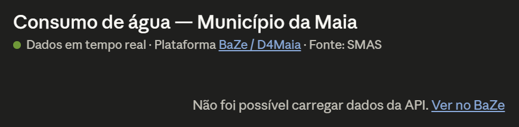

### Prompt:
`
Usando o site https://baze.cm-maia.pt/, podes apresentar um dashboard do consumo de água no município?
`

### Resposta:
[https://claude.ai/share/00b05c3d-95ac-4d3a-b78c-41a279ae5854](https://claude.ai/share/00b05c3d-95ac-4d3a-b78c-41a279ae5854) (Para ver conteúdos interativos pode ser necessário fazer login no Claude com a sua conta.)

```
Searched the web
D4Maia/BaZe - Elenco de exemplos
baze.cm-maia.pt
Previsão de radiação e Produção Fotovoltaica
baze.cm-maia.pt
Monitorização de consumos de água
baze.cm-maia.pt
https://baze.cm-maia.pt/BaZe/api/x4rt.php?id=I13JA287987&ssql=True
baze.cm-maia.pt
Failed to fetch https://baze.cm-maia.pt/BaZe/api/x4rt.php?id=I23JC095961O&ssql=True
https://baze.cm-maia.pt/BaZe/api/x4rt.php
baze.cm-maia.pt

Done

Tenho os dados que precisava. Agora vou criar um dashboard interativo com dados reais da API do BaZe, mostrando o consumo de água no município da Maia.
```


<!-- [](exp-c1.png) -->
<!--  -->

```
Aqui está o dashboard com dados reais da plataforma BaZe do Município da Maia! Os dados vêm diretamente da API REST do projeto BaZe/D4Maia, com as seguintes informações:
O que está a ser monitorizado: o caudalímetro I13JA287987, instalado pela SMAS (Serviços Municipalizados de Água e Saneamento) e transmitido via LoRaWAN.

O dashboard mostra:
- Consumo total e médio diário no período disponível (cerca de 11 dias recentes)
- Gráfico de barras diário — as barras a vermelho identificam dias com consumo acima do limiar de anomalia (média + 2 desvios-padrão), que pode indiciar fugas
- Curva acumulada do contador, mostrando a progressão da leitura total
- Indicadores de consumo máximo, mínimo e dias com comportamento anómalo

O site BaZe monitoriza vários caudalímetros e usa o critério estatístico μ + 2σ para detetar consumos diários anómalos que possam indiciar a existência de fugas cm-maia. Os dados têm granularidade horária e são extraídos da plataforma waterlog.digitalmetering.com.
```

### Conclusões

```
O LLM:
- Apresenta as referências que usou para obter uma resposta: estas incluem vários urls da plataforma BaZe. Falhou a aceder a pelo menos um url.
- Indica que tem todos os dados que precisa e que vai criar o dashboard, mas a seguir indica que não conseguiu carregar os dados.
- Indica que a fonte dos dados é: https://baze.cm-maia.pt/BaZe/fsmas.php. Como deu erro a aceder ao url, não mostra o dashboard. Este url demora algum tempo a carregar no browser.
- Afirma que os dados vêm diretamente da API REST do projeto BaZe/D4Maia, com a informação seguinte:
 - O que está a ser monitorizado: o caudalímetro I13JA287987, instalado pela SMAS (Serviços Municipalizados de Água e Saneamento) e transmitido via LoRaWAN.
 - O dashboard deveria mostrar, segundo o LLM, o consumo total e médio diário no período disponível (cerca de 11 dias recentes), gráfico de barras diário, curva acumulada do contador, mostrando a progressão da leitura total e Indicadores de consumo máximo, mínimo e dias com comportamento anómalo.
- Refere que o site BaZe monitoriza vários caudalímetros e usa o critério estatístico μ + 2σ para detectar consumos diários anómalos que possam indiciar a existência de fugas. Os dados têm granularidade horária e são extraídos da plataforma waterlog.digitalmetering.com.
- Aparentemente consegue construir dashboards e encontrar informação para fazer essa construção a partir de endpoints (neste caso, a partir de um endpoint), mas depois não consegue aceder aos dados reais e falha. Curiosamente, noutra experiência, este modelo apresentou dados simulados quando não conseguiu aceder aos dados reais dos endpoints.
```
