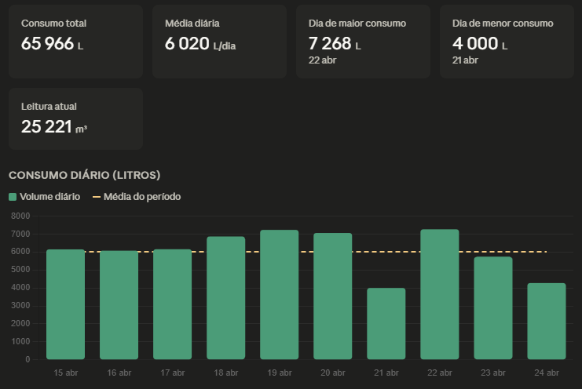
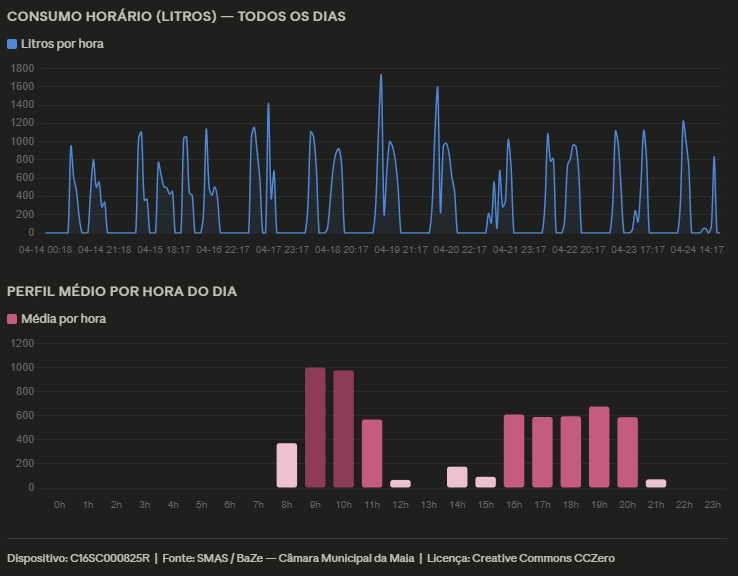

### Prompt:
```
 
Usando o endpoint https://baze.cm-maia.pt/BaZe/api/x4rt.php?id=C16SC000825R&ssql=True&tend=2026-04-26&tstart=2026-04-18, podes apresentar um dashboard do consumo de água no município?
 
```

### Resposta:
[https://claude.ai/share/18ce110d-4e06-4daa-994c-37734f19fc4c](https://claude.ai/share/18ce110d-4e06-4daa-994c-37734f19fc4c) (Para ver conteúdos interativos pode ser necessário fazer login no Claude com a sua conta.)

```
Fetched: https://baze.cm-maia.pt/BaZe/api/x4rt.php?id=C16SC000825R&ssql=True&tend=2026-04-26&tstart=2026-04-18

Done
```





```
Aqui está o dashboard do consumo de água do dispositivo C16SC000825R (SMAS / Câmara Municipal da Maia), com dados entre 14 e 24 de abril de 2026.

Alguns destaques dos dados:

Consumo total e médias — ao longo de ~11 dias foram registados 65 966 litros, com uma média diária de 6 020 L.
Pico de consumo — o dia 22 de abril foi o de maior consumo (7 268 L), seguido de 19 de abril (7 234 L). O dia 21 de abril foi o mais baixo (4 000 L).

Perfil horário típico — o consumo é praticamente nulo entre as 00h e as 06h (período noturno), com picos consistentes nas horas 09h–10h e novamente às 16h–18h, o que é típico de um padrão de abastecimento urbano com dois momentos de maior procura (manhã e tarde).

Leitura acumulada — o contador passou de 25 155 100 L para 25 221 100 L no período observado.
```

### Conclusões

```
O LLM:
- Apresenta as referências usadas para obter a resposta: aparentemente só consultou o endpoint apresentado no prompt.
- Aparentemente, conseguiu aceder aos dados e mostra um dashboard interativo.
 - O Dashboard apresenta o consumo de água do dispositivo C16SC000825R (SMAS/Câmara Municipal da Maia), com dados entre 14 e 24 de abril de 2026.
 - Para além do dashboard o LLM apresenta algumas análises sobre os dados, por exemplo sobre picos de consumo.
Os dados apresentados parecem alinhados com os dados apresentados na página [https://baze.cm-maia.pt/BaZe/fsmas.php](https://baze.cm-maia.pt/BaZe/fsmas.php) embora esta tenha demorado bastante tempo a carregar e só analisei a informação apresentada nas tabelas.
O dashboard apresenta informação como por exemplo:
- Consumo diário (litros),
- Consumo horário (litros) - todos os dias e Perfil médio por hora do dia.
- Consumo total,
- Média diária,
- Dia de maior e menor consumo e Leitura atual.

Este resultado parece indicar que este LLM tem a capacidade de criar dashboards a partir de endpoints que retornam os dados diretamente, desde que tenha acesso aos dados. Mas existem outros resultados onde o LLM criou ou não um dashboard quando não teve acesso aos dados ou a parte dos dados. Existe assim alguma incerteza no resultado embora o LLM tenha a capacidade de criar dashboards. Isto parece indicar a necessidade de uma análise mais profunda e detalhada para perceber por que razão o LLM por vezes não consegue aceder aos dados.
```
