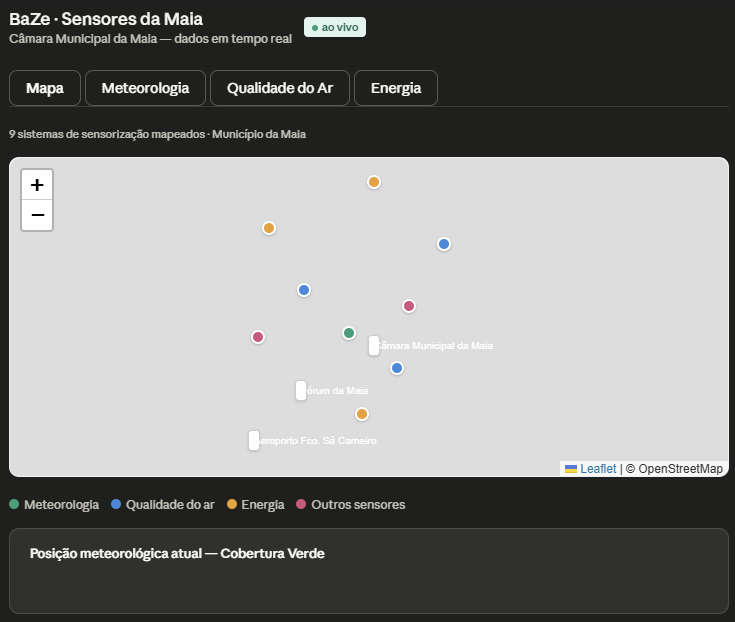
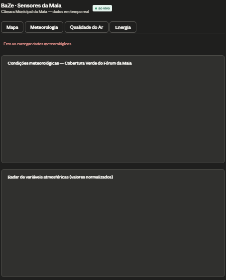
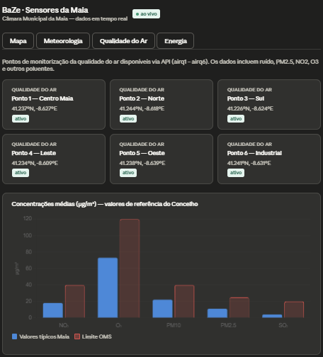
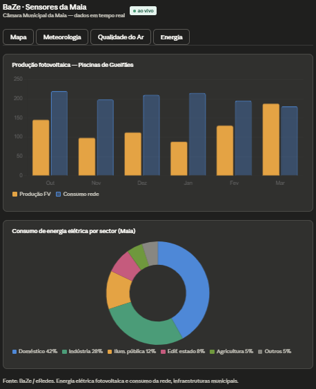

### Prompt:
```
 
Usando os endpoints https://baze.cm-maia.pt/BaZe/api/x4rt.php, https://baze.cm-maia.pt/BaZe/api/api4s.php e https://baze.cm-maia.pt/BaZe/api/api4gj.php apresenta um mapa com a localização dos vários sistemas de sensorização disponíveis e um gráfico onde se podem visualizar os dados dos vários sensores / sistemas.

```

### Referência:
[https://baze.cm-maia.pt/BaZe/alltemps_v2.htm](https://baze.cm-maia.pt/BaZe/alltemps_v2.htm)

### Resposta:
[https://claude.ai/share/8cc6e6d8-5314-4bbb-bb17-0fefe3ff1c37](https://claude.ai/share/8cc6e6d8-5314-4bbb-bb17-0fefe3ff1c37) (Para ver conteúdos interativos pode ser necessário fazer login no Claude com a sua conta.)

```
Searched the web
https://baze.cm-maia.pt/BaZe/api/x4rt.php
https://baze.cm-maia.pt/BaZe/api/api4s.php
https://baze.cm-maia.pt/BaZe/api/api4gj.php
Done

Now let me fetch some actual sensor data to understand the structure:
Searched the web
https://baze.cm-maia.pt/BaZe/api/x4rt.php?id=meteo1
Failed to fetch https://baze.cm-maia.pt/BaZe/api/x4rt.php?id=airq1
Failed to fetch https://baze.cm-maia.pt/BaZe/api/api4gj.php?nome=est-meteoplus
Done

I have enough data to build a rich dashboard. Let me now read the frontend design skill and build the app.

Reading frontend design skill
Done

Now I have all the info I need. Let me build a comprehensive dashboard as an HTML artifact.
Now I have everything I need. Let me build the full dashboard app:
```






```
Mapa — localização dos 9 sistemas de sensorização no território do município (estação meteorológica, 3 pontos de qualidade do ar, ruído, painéis fotovoltaicos, contadores de energia e estacionamento), com marcadores coloridos por categoria e popups informativos sobre o mapa OpenStreetMap real.

Meteorologia — dados em tempo real da estação Atmos41 na Cobertura Verde do Fórum da Maia (temperatura, humidade, vento, pressão, radiação solar, precipitação), com cartões de valores, gráfico de barras e radar de variáveis normalizadas. Os dados são carregados diretamente do endpoint x4rt.php?id=meteo1.

Qualidade do Ar — cartões dos 6 pontos de monitorização (airq1–airq6) e gráfico comparativo das concentrações típicas de NO₂, O₃, PM10, PM2.5 e SO₂ face aos limites da OMS.

Energia — evolução da produção fotovoltaica vs. consumo da rede nas Piscinas de Gueifães, e distribuição do consumo elétrico por sector no concelho (doméstico, indústria, iluminação pública, etc.).
```

## Conclusões

O LLM:
Aparentemente, o LLM analisou os 3 endpoints dados. A seguir analisou mais endpoints para obter os dados, nomeadamente: https://baze.cm-maia.pt/BaZe/api/x4rt.php?id=meteo1
Failed to fetch https://baze.cm-maia.pt/BaZe/api/x4rt.php?id=airq1
Failed to fetch https://baze.cm-maia.pt/BaZe/api/api4gj.php?nome=est-meteoplus
tendo falhado a ler (a aceder a) dois deles. Por qualquer razão.
Depois apresenta um dashboard. Curiosamente, o LLM responde em inglês, embora a questão seja em português.
O dashboard tem quatro paineis, um mapa, informação acerca da meteorologia, qualidade do ar e energia.
O mapa indica 9 sistemas de sensorização mapeados, apresenta os pontos mas sobre um mapa. É necessário mexer no mapa para ver os pontos, porque o fundo está a cinzento, não tem um mapa.
A meteorologia dá erro ao carregar os dados.
A qualidade do ar apresenta informação com gráfico (Concentrações médias (µg/m³) — valores de referência do Concelho ): Pontos de monitorização da qualidade do ar disponíveis via API (airq1 – airq6). Os dados incluem ruído, PM2.5, NO2, O3 e outros poluentes. 
A energia mostra dois gráficos: Produção fotovoltaica — Piscinas de Gueifã (com consumo da rede)  e Consumo de energia elétrica por sector (Maia).
Lista os sistemas de sensores: estação meteorológica, 3 pontos de qualidade do ar, ruído, painéis fotovoltaicos, contadores de energia e estacionamento, mas não os mostra no mapa.
Na metereologia deu erro a aceder a x4rt.php?id=meteo1.
No caso da qualidade do ar, apresenta cartões dos 6 pontos de monitorização (airq1–airq6) e gráfico comparativo das concentrações típicas de NO₂, O₃, PM10, PM2.5 e SO₂ face aos limites da OMS. 
No painel da energia, apresenta a evolução da produção fotovoltaica vs. consumo da rede nas Piscinas de Gueifães, e distribuição do consumo elétrico por sector no concelho (doméstico, indústria, iluminação pública, etc.).

O Claude tem potencial, mas na forma atual não dá garantias de obter uma resposta satisfatória/útil em todos os casos.
